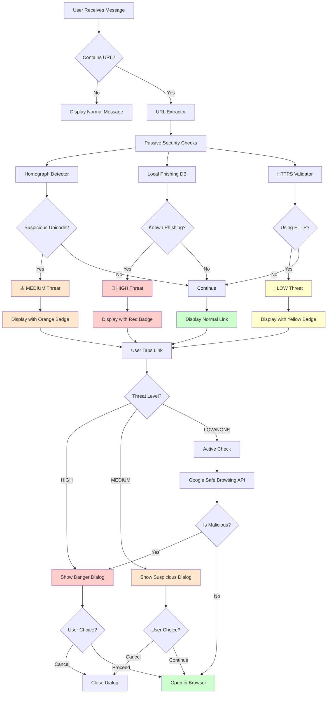

## Architecture Layers

### Layer 1: Passive Detection (Instant, No Network)
```
┌─────────────────────────────────────────────┐
│         PASSIVE SECURITY CHECKS             │
├─────────────────────────────────────────────┤
│ 1. Homograph Detector                       │
│    - Detects Unicode lookalikes             │
│    - Example: googIe.com (capital i)        │
│                                             │
│ 2. Local Phishing Database                  │
│    - 20+ known phishing domains             │
│    - Levenshtein distance matching          │
│    - Instant offline lookup                 │
│                                             │
│ 3. HTTPS Validator                          │
│    - Checks for secure connection           │
│    - Warns on HTTP links                    │
└─────────────────────────────────────────────┘
         ↓
    < 1ms per URL
```

### Layer 2: Active Detection (On-Tap, Network Required)
```
┌─────────────────────────────────────────────┐
│        ACTIVE SECURITY CHECKS               │
├─────────────────────────────────────────────┤
│ Google Safe Browsing API v4                 │
│    - Checks against global threat DB        │
│    - Detects:                               │
│      • Malware                              │
│      • Social Engineering                   │
│      • Unwanted Software                    │
│      • Harmful Applications                 │
└─────────────────────────────────────────────┘
         ↓
    100-300ms
```

## Data Flow

```
┌──────────────┐
│   Message    │
│  "Visit      │
│  paypal-     │
│  verify.com" │
└──────┬───────┘
       │
       ↓
┌──────────────────┐
│  URL Extractor   │
│  Finds:          │
│  paypal-         │
│  verify.com      │
└──────┬───────────┘
       │
       ↓
┌─────────────────────┐
│ Homograph Detector  │
│ Result: Clean       │
│ (No Unicode tricks) │
└──────┬──────────────┘
       │
       ↓
┌─────────────────────────┐
│ Local Phishing Database │
│ ✓ MATCH FOUND!          │
│ "Impersonates PayPal"   │
└──────┬──────────────────┘
       │
       ↓
┌─────────────────┐
│  Threat Level:  │
│  🚨 HIGH 🚨      │
└──────┬──────────┘
       │
       ↓
┌─────────────────────────┐
│ Display Message with    │
│ RED "Dangerous Link"    │
│ Badge                   │
└──────┬──────────────────┘
       │
       ↓ (User taps link)
       │
┌─────────────────────────┐
│ Show Full-Screen        │
│ Warning Dialog          │
│                         │
│ [Go Back] [Open Anyway] │
└─────────────────────────┘
```

## Component Interaction

```
┌─────────────────────────────────────────────────────┐
│                   Chat Screen                        │
│  ┌───────────────────────────────────────────────┐  │
│  │           Message Bubble                      │  │
│  │  ┌─────────────────────────────────────────┐ │  │
│  │  │     SecureLinkText Widget               │ │  │
│  │  │  - Replaces Text widget                 │ │  │
│  │  │  - Automatic security scanning          │ │  │
│  │  │  - Renders clickable links              │ │  │
│  │  └─────────────┬───────────────────────────┘ │  │
│  │                │                              │  │
│  │                ↓                              │  │
│  │  ┌─────────────────────────────────────────┐ │  │
│  │  │   SecurityWarningBadge (if needed)      │ │  │
│  │  │   🚨 Dangerous Link                     │ │  │
│  │  └─────────────────────────────────────────┘ │  │
│  └───────────────────────────────────────────────┘  │
└─────────────────────────────────────────────────────┘
                      │
                      ↓
         ┌────────────────────────┐
         │ MessageSecurityService │
         │  (Main Orchestrator)   │
         └────────────────────────┘
                      │
        ┌─────────────┼─────────────┐
        ↓             ↓             ↓
  ┌──────────┐  ┌──────────┐  ┌──────────┐
  │Homograph │  │ Local DB │  │  Google  │
  │ Detector │  │          │  │   API    │
  └──────────┘  └──────────┘  └──────────┘
```

## Threat Level Decision Tree

```
URL Detected
    │
    ├─ Contains Unicode lookalikes? ────→ MEDIUM (Orange)
    │
    ├─ In local phishing DB? ──────────→ HIGH (Red)
    │
    ├─ Using HTTP (not HTTPS)? ────────→ LOW (Yellow)
    │
    └─ All checks pass ────────────────→ NONE (Blue/Normal)

On Link Tap:
    │
    ├─ HIGH Threat ────→ Full Warning Dialog
    │                    "This link is dangerous"
    │                    [Go Back] [Open Anyway]
    │
    ├─ MEDIUM Threat ──→ Confirmation Dialog
    │                    "Suspicious link detected"
    │                    [Cancel] [Continue]
    │
    └─ LOW/NONE ───────→ Google Safe Browsing Check
                         │
                         ├─ Malicious? ──→ Full Warning Dialog
                         │
                         └─ Clean? ──────→ Open Browser
```

## Privacy-First Design

```
┌─────────────────────────────────────────────────┐
│              PRIVACY PROTECTION                  │
├─────────────────────────────────────────────────┤
│                                                 │
│  ✅ Local Processing First                      │
│     - Homograph check: On-device                │
│     - Database lookup: Offline                  │
│     - No data leaves device                     │
│                                                 │
│  ✅ Minimal Data Sent to Google                 │
│     - Only URL (not full message)               │
│     - Only when user taps link                  │
│     - Only if not already flagged               │
│                                                 │
│  ✅ No Logging                                  │
│     - No user data stored                       │
│     - No message content saved                  │
│     - No analytics tracking                     │
│                                                 │
│  ✅ Fail-Safe Design                            │
│     - API errors default to "safe"              │
│     - Network failures don't block              │
│     - User always in control                    │
│                                                 │
└─────────────────────────────────────────────────┘
```

## Performance Metrics

```
Operation                Time        Network Required
─────────────────────────────────────────────────────
URL Extraction           < 1ms       No
Homograph Check          < 1ms       No
Local DB Lookup          1-5ms       No
HTTPS Validation         < 1ms       No
─────────────────────────────────────────────────────
Passive Total            < 10ms      No
─────────────────────────────────────────────────────
Google Safe Browsing     100-300ms   Yes (on tap)
Dialog Display           Instant     No
─────────────────────────────────────────────────────
```
