# SentriZK — Advanced Functional Diagrams
**FYP: Zero-Knowledge Authenticated Internal Chat with On-Device AI Threat Detection**
*Mohammad Azri Bin Aziz · Bachelor of IT (BCSS) · 2024/2025*

---

> [!IMPORTANT]
> This document contains **two complete diagram sets**:
> - **Part A — Professional Technical Reference** (pure technical detail, every component)
> - **Part B — Example-Annotated Walkthrough** (same diagrams with real values & analogies for presentations)

---

# PART A — PROFESSIONAL TECHNICAL REFERENCE DIAGRAMS

---

## A1. Full System Architecture Overview

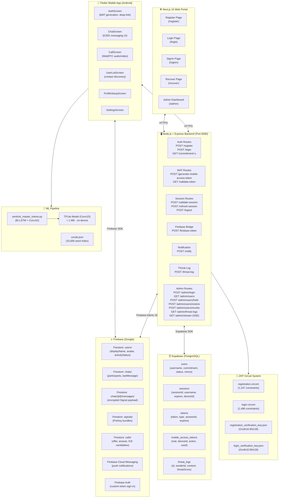
```mermaid
graph TB
    subgraph CLIENT_MOBILE["📱 Flutter Mobile App (Android)"]
        AM_AUTH["AuthScreen\n(MAT generation, deep-link)"]
        AM_CHAT["ChatScreen\n(E2EE messaging UI)"]
        AM_CALL["CallScreen\n(WebRTC audio/video)"]
        AM_ULIST["UserListScreen\n(contact discovery)"]
        AM_PROF["ProfileSetupScreen"]
        AM_SET["SettingsScreen"]
    end

    subgraph CLIENT_WEB["🌐 Next.js 15 Web Portal"]
        WP_REG["Register Page\n(/register)"]
        WP_LOGIN["Login Page\n(/login)"]
        WP_SIGN["SignIn Page\n(/signin)"]
        WP_RECOV["Recover Page\n(/recover)"]
        WP_ADMIN["Admin Dashboard\n(/admin)"]
    end

    subgraph BACKEND["🖥️ Node.js + Express Backend (Port 6000)"]
        BE_AUTH["Auth Routes\nPOST /register\nPOST /login\nGET /commitment/:u"]
        BE_MAT["MAT Routes\nPOST /generate-mobile-access-token\nGET /validate-token"]
        BE_SES["Session Routes\nPOST /validate-session\nPOST /refresh-session\nPOST /logout"]
        BE_FB["Firebase Bridge\nPOST /firebase-token"]
        BE_NOT["Notification\nPOST /notify"]
        BE_THR["Threat Log\nPOST /threat-log"]
        BE_ADM["Admin Routes\nPOST /admin/login\nGET /admin/users\nPOST /admin/users/hold\nPOST /admin/users/restore\nPOST /admin/users/revoke\nGET /admin/threat-logs\nGET /admin/stream (SSE)"]
    end

    subgraph SUPABASE["🗄️ Supabase (PostgreSQL)"]
        DB_USERS["users\n(username, commitment, status, nonce)"]
        DB_SESS["sessions\n(sessionId, username, expires, deviceId)"]
        DB_TOK["tokens\n(token, type, sessionId, expires)"]
        DB_MAT["mobile_access_tokens\n(mat, deviceId, action, used)"]
        DB_THR["threat_logs\n(id, senderId, content, threatScore)"]
    end

    subgraph FIREBASE["🔥 Firebase (Google)"]
        FS_PROFILES["Firestore: users/\n(displayName, avatar, activityStatus)"]
        FS_CHATS["Firestore: chats/\n(participants, lastMessage)"]
        FS_MSGS["Firestore: chats/{id}/messages/\n(encrypted Signal payload)"]
        FS_SIGNALS["Firestore: signals/\n(PreKey bundles)"]
        FS_CALLS["Firestore: calls/\n(offer, answer, ICE candidates)"]
        FS_FCM["Firebase Cloud Messaging\n(push notifications)"]
        FS_AUTH["Firebase Auth\n(custom token sign-in)"]
    end

    subgraph ZKP["🔐 ZKP Circuit System"]
        ZKP_RC["registration.circom\n(1,247 constraints)"]
        ZKP_LC["login.circom\n(1,486 constraints)"]
        ZKP_RVK["registration_verification_key.json\n(Groth16 BN128)"]
        ZKP_LVK["login_verification_key.json\n(Groth16 BN128)"]
    end

    subgraph ML["🤖 ML Pipeline"]
        ML_TFLITE["TFLite Model (Conv1D)\n< 1 MB · on-device"]
        ML_VOCAB["vocab.json\n(10,000 word index)"]
        ML_TRAINER["sentrizk_master_trainer.py\n(Bi-LSTM + Conv1D)"]
    end

    CLIENT_MOBILE <-->|HTTPS| BACKEND
    CLIENT_WEB <-->|HTTPS| BACKEND
    BACKEND <-->|Supabase SDK| SUPABASE
    BACKEND <-->|Firebase Admin SDK| FIREBASE
    CLIENT_MOBILE <-->|Firebase SDK| FIREBASE
    BACKEND --> ZKP
    CLIENT_MOBILE --> ML
    ML_TRAINER --> ML_TFLITE
```

---

## A2. ZKP Registration Flow — Complete Technical Detail

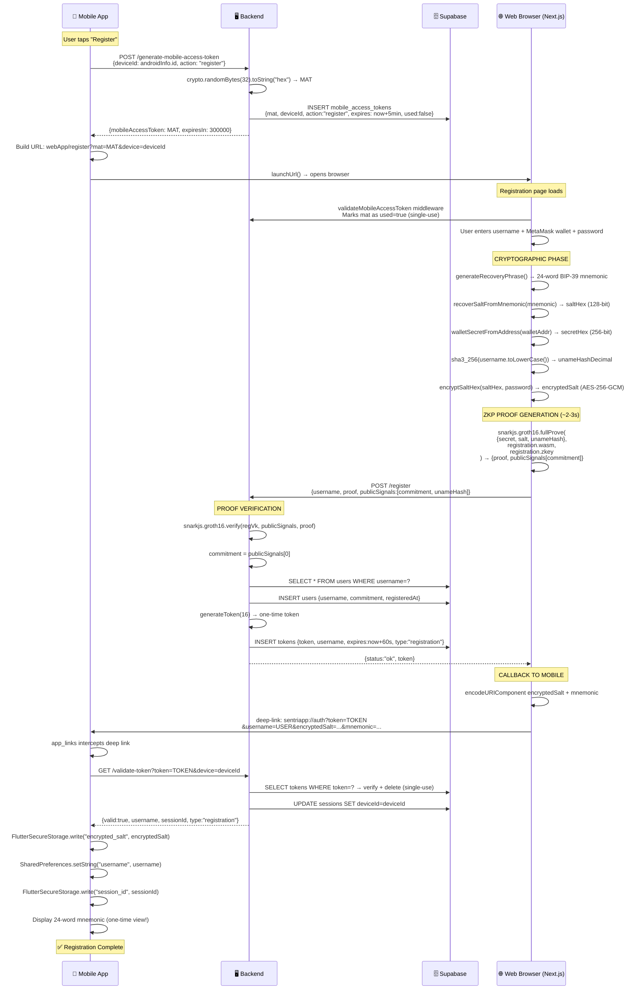
```mermaid
sequenceDiagram
    participant MOB as 📱 Mobile App
    participant BAK as 🖥️ Backend
    participant SUP as 🗄️ Supabase
    participant WEB as 🌐 Web Browser (Next.js)

    Note over MOB: User taps "Register"
    MOB->>BAK: POST /generate-mobile-access-token<br/>{deviceId: androidInfo.id, action: "register"}
    BAK->>BAK: crypto.randomBytes(32).toString("hex") → MAT
    BAK->>SUP: INSERT mobile_access_tokens<br/>{mat, deviceId, action:"register", expires: now+5min, used:false}
    BAK-->>MOB: {mobileAccessToken: MAT, expiresIn: 300000}

    MOB->>MOB: Build URL: webApp/register?mat=MAT&device=deviceId
    MOB->>WEB: launchUrl() → opens browser

    Note over WEB: Registration page loads
    WEB->>BAK: validateMobileAccessToken middleware<br/>Marks mat as used=true (single-use)
    WEB->>WEB: User enters username + MetaMask wallet + password
    
    Note over WEB: CRYPTOGRAPHIC PHASE
    WEB->>WEB: generateRecoveryPhrase() → 24-word BIP-39 mnemonic
    WEB->>WEB: recoverSaltFromMnemonic(mnemonic) → saltHex (128-bit)
    WEB->>WEB: walletSecretFromAddress(walletAddr) → secretHex (256-bit)
    WEB->>WEB: sha3_256(username.toLowerCase()) → unameHashDecimal
    WEB->>WEB: encryptSaltHex(saltHex, password) → encryptedSalt (AES-256-GCM)

    Note over WEB: ZKP PROOF GENERATION (~2-3s)
    WEB->>WEB: snarkjs.groth16.fullProve(<br/>  {secret, salt, unameHash},<br/>  registration.wasm,<br/>  registration.zkey<br/>) → {proof, publicSignals[commitment]}

    WEB->>BAK: POST /register<br/>{username, proof, publicSignals:[commitment, unameHash]}
    
    Note over BAK: PROOF VERIFICATION
    BAK->>BAK: snarkjs.groth16.verify(regVk, publicSignals, proof)
    BAK->>BAK: commitment = publicSignals[0]
    BAK->>SUP: SELECT * FROM users WHERE username=?
    BAK->>SUP: INSERT users {username, commitment, registeredAt}
    BAK->>BAK: generateToken(16) → one-time token
    BAK->>SUP: INSERT tokens {token, username, expires:now+60s, type:"registration"}
    BAK-->>WEB: {status:"ok", token}

    Note over WEB: CALLBACK TO MOBILE
    WEB->>WEB: encodeURIComponent encryptedSalt + mnemonic
    WEB->>MOB: deep-link: sentriapp://auth?token=TOKEN<br/>&username=USER&encryptedSalt=...&mnemonic=...

    MOB->>MOB: app_links intercepts deep link
    MOB->>BAK: GET /validate-token?token=TOKEN&device=deviceId
    BAK->>SUP: SELECT tokens WHERE token=? → verify + delete (single-use)
    BAK->>SUP: UPDATE sessions SET deviceId=deviceId
    BAK-->>MOB: {valid:true, username, sessionId, type:"registration"}

    MOB->>MOB: FlutterSecureStorage.write("encrypted_salt", encryptedSalt)
    MOB->>MOB: SharedPreferences.setString("username", username)
    MOB->>MOB: FlutterSecureStorage.write("session_id", sessionId)
    MOB->>MOB: Display 24-word mnemonic (one-time view!)
    Note over MOB: ✅ Registration Complete
```

---

## A3. ZKP Login Flow — Complete Technical Detail

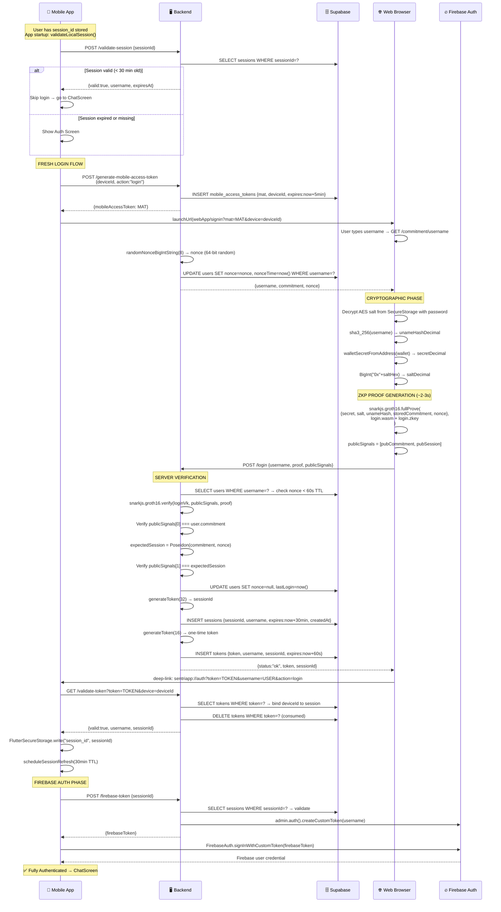
```mermaid
sequenceDiagram
    participant MOB as 📱 Mobile App
    participant BAK as 🖥️ Backend
    participant SUP as 🗄️ Supabase
    participant WEB as 🌐 Web Browser
    participant FBA as 🔥 Firebase Auth

    Note over MOB: User has session_id stored<br/>App startup: validateLocalSession()
    MOB->>BAK: POST /validate-session {sessionId}
    BAK->>SUP: SELECT sessions WHERE sessionId=?
    
    alt Session valid (< 30 min old)
        BAK-->>MOB: {valid:true, username, expiresAt}
        MOB->>MOB: Skip login → go to ChatScreen
    else Session expired or missing
        MOB->>MOB: Show Auth Screen
    end

    Note over MOB: FRESH LOGIN FLOW
    MOB->>BAK: POST /generate-mobile-access-token<br/>{deviceId, action:"login"}
    BAK->>SUP: INSERT mobile_access_tokens {mat, deviceId, expires:now+5min}
    BAK-->>MOB: {mobileAccessToken: MAT}

    MOB->>WEB: launchUrl(webApp/signin?mat=MAT&device=deviceId)
    WEB->>WEB: User types username → GET /commitment/username

    BAK->>BAK: randomNonceBigIntString(8) → nonce (64-bit random)
    BAK->>SUP: UPDATE users SET nonce=nonce, nonceTime=now() WHERE username=?
    BAK-->>WEB: {username, commitment, nonce}

    Note over WEB: CRYPTOGRAPHIC PHASE
    WEB->>WEB: Decrypt AES salt from SecureStorage with password
    WEB->>WEB: sha3_256(username) → unameHashDecimal
    WEB->>WEB: walletSecretFromAddress(wallet) → secretDecimal
    WEB->>WEB: BigInt("0x"+saltHex) → saltDecimal

    Note over WEB: ZKP PROOF GENERATION (~2-3s)
    WEB->>WEB: snarkjs.groth16.fullProve(<br/>  {secret, salt, unameHash, storedCommitment, nonce},<br/>  login.wasm + login.zkey<br/>)
    WEB->>WEB: publicSignals = [pubCommitment, pubSession]

    WEB->>BAK: POST /login {username, proof, publicSignals}
    
    Note over BAK: SERVER VERIFICATION
    BAK->>SUP: SELECT users WHERE username=? → check nonce < 60s TTL
    BAK->>BAK: snarkjs.groth16.verify(loginVk, publicSignals, proof)
    BAK->>BAK: Verify publicSignals[0] === user.commitment
    BAK->>BAK: expectedSession = Poseidon(commitment, nonce)
    BAK->>BAK: Verify publicSignals[1] === expectedSession
    BAK->>SUP: UPDATE users SET nonce=null, lastLogin=now()
    BAK->>BAK: generateToken(32) → sessionId
    BAK->>SUP: INSERT sessions {sessionId, username, expires:now+30min, createdAt}
    BAK->>BAK: generateToken(16) → one-time token
    BAK->>SUP: INSERT tokens {token, username, sessionId, expires:now+60s}
    BAK-->>WEB: {status:"ok", token, sessionId}

    WEB->>MOB: deep-link: sentriapp://auth?token=TOKEN&username=USER&action=login

    MOB->>BAK: GET /validate-token?token=TOKEN&device=deviceId
    BAK->>SUP: SELECT tokens WHERE token=? → bind deviceId to session
    BAK->>SUP: DELETE tokens WHERE token=? (consumed)
    BAK-->>MOB: {valid:true, username, sessionId}

    MOB->>MOB: FlutterSecureStorage.write("session_id", sessionId)
    MOB->>MOB: scheduleSessionRefresh(30min TTL)

    Note over MOB: FIREBASE AUTH PHASE
    MOB->>BAK: POST /firebase-token {sessionId}
    BAK->>SUP: SELECT sessions WHERE sessionId=? → validate
    BAK->>FBA: admin.auth().createCustomToken(username)
    BAK-->>MOB: {firebaseToken}
    MOB->>FBA: FirebaseAuth.signInWithCustomToken(firebaseToken)
    FBA-->>MOB: Firebase user credential
    Note over MOB: ✅ Fully Authenticated → ChatScreen
```

---

## A4. Signal Protocol E2EE Messaging — Complete Technical Detail

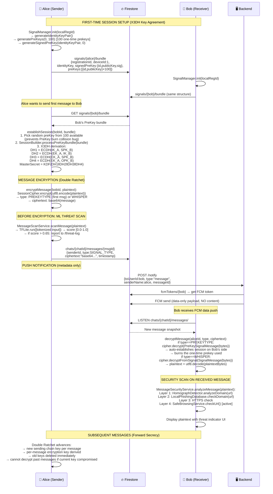
```mermaid
sequenceDiagram
    participant ALICE as 📱 Alice (Sender)
    participant FS as 🔥 Firestore
    participant BOB as 📱 Bob (Receiver)
    participant BAK as 🖥️ Backend

    Note over ALICE,BOB: FIRST-TIME SESSION SETUP (X3DH Key Agreement)

    ALICE->>ALICE: SignalManager.init(localRegId)<br/>→ generateIdentityKeyPair()<br/>→ generatePreKeys(0, 100) [100 one-time prekeys]<br/>→ generateSignedPreKey(identityKeyPair, 0)
    ALICE->>FS: signals/{alice}/bundle<br/>{registrationId, deviceId:1,<br/>identityKey, signedPreKey:{id,publicKey,sig},<br/>preKeys:[{id,publicKey}×100]}

    BOB->>BOB: SignalManager.init(localRegId)
    BOB->>FS: signals/{bob}/bundle (same structure)

    Note over ALICE: Alice wants to send first message to Bob

    ALICE->>FS: GET signals/{bob}/bundle
    FS-->>ALICE: Bob's PreKey bundle

    ALICE->>ALICE: establishSession(bobId, bundle):<br/>1. Pick random preKey from 100 available<br/>   (prevents PreKey burn collision bug)<br/>2. SessionBuilder.processPreKeyBundle(bundle)<br/>3. X3DH derivation:<br/>   DH1 = ECDH(IK_A, SPK_B)<br/>   DH2 = ECDH(EK_A, IK_B)<br/>   DH3 = ECDH(EK_A, SPK_B)<br/>   DH4 = ECDH(EK_A, OPK_B)<br/>   MasterSecret = KDF(DH1‖DH2‖DH3‖DH4)

    Note over ALICE: MESSAGE ENCRYPTION (Double Ratchet)

    ALICE->>ALICE: encryptMessage(bobId, plaintext):<br/>SessionCipher.encrypt(utf8.encode(plaintext))<br/>→ type: PREKEYTYPE (first msg) or WHISPER<br/>→ ciphertext: base64(message)

    Note over ALICE: BEFORE ENCRYPTION: ML THREAT SCAN
    ALICE->>ALICE: MessageScanService.scanMessage(plaintext)<br/>→ TFLite.run([tokenized input]) → score [0.0-1.0]<br/>→ if score > 0.65: report to /threat-log

    ALICE->>FS: chats/{chatId}/messages/{msgId}<br/>{senderId, type:SIGNAL_TYPE,<br/>ciphertext:"base64...", timestamp}

    Note over ALICE: PUSH NOTIFICATION (metadata only)
    ALICE->>BAK: POST /notify<br/>{toUserId:bob, type:"message",<br/>senderName:alice, messageId}
    BAK->>FS: fcmTokens/{bob} → get FCM token
    BAK->>FS: FCM send (data-only payload, NO content)

    Note over BOB: Bob receives FCM data push
    BOB->>FS: LISTEN chats/{chatId}/messages/
    FS-->>BOB: New message snapshot

    BOB->>BOB: decryptMessage(aliceId, type, ciphertext):<br/>if type==PREKEYTYPE:<br/>  cipher.decrypt(PreKeySignalMessage(bytes))<br/>  → auto-establishes session on Bob's side<br/>  → burns the one-time prekey used<br/>if type==WHISPER:<br/>  cipher.decryptFromSignal(SignalMessage(bytes))<br/>→ plaintext = utf8.decode(plaintextBytes)

    Note over BOB: SECURITY SCAN ON RECEIVED MESSAGE
    BOB->>BOB: MessageSecurityService.analyzeMessage(plaintext):<br/>Layer 1: HomographDetector.analyzeDomain(url)<br/>Layer 2: LocalPhishingDatabase.checkDomain(url)<br/>Layer 3: HTTPS check<br/>Layer 4: SafeBrowsingService.checkUrl() [active]
    BOB->>BOB: Display plaintext with threat indicator UI

    Note over ALICE,BOB: SUBSEQUENT MESSAGES (Forward Secrecy)
    ALICE->>ALICE: Double Ratchet advances:<br/>→ new sending chain key per message<br/>→ per-message encryption key derived<br/>→ old keys deleted immediately<br/>→ cannot decrypt past messages if current key compromised
```

---

## A5. WebRTC Audio/Video Call Flow — Complete Technical Detail

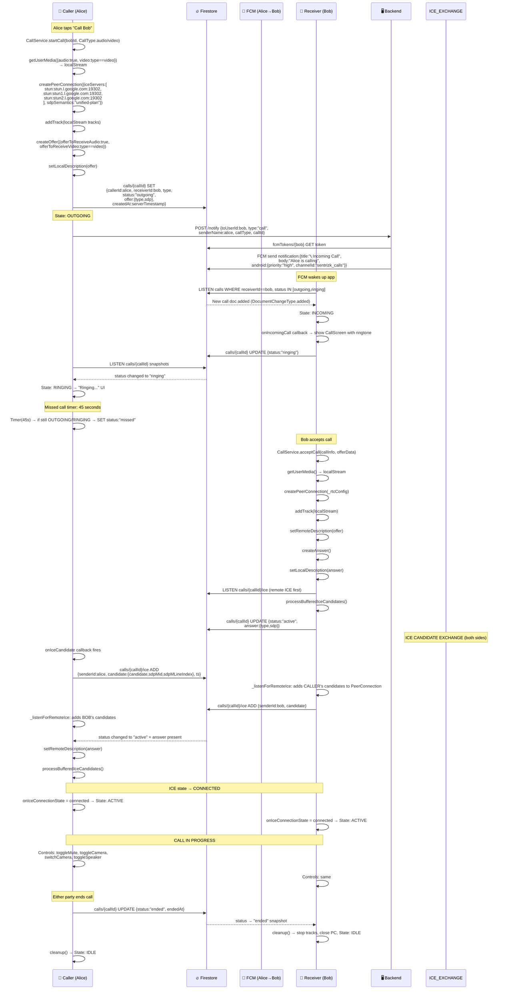
```mermaid
sequenceDiagram
    participant CALLER as 📱 Caller (Alice)
    participant FS as 🔥 Firestore
    participant CALLER_FCM as 🔔 FCM (Alice→Bob)
    participant BOB as 📱 Receiver (Bob)
    participant BAK as 🖥️ Backend

    Note over CALLER: Alice taps "Call Bob"

    CALLER->>CALLER: CallService.startCall(bobId, CallType.audio/video)
    CALLER->>CALLER: getUserMedia({audio:true, video:type==video})<br/>→ localStream
    CALLER->>CALLER: createPeerConnection({iceServers:[<br/>  stun:stun.l.google.com:19302,<br/>  stun:stun1.l.google.com:19302,<br/>  stun:stun2.l.google.com:19302<br/>], sdpSemantics:"unified-plan"})
    CALLER->>CALLER: addTrack(localStream tracks)
    CALLER->>CALLER: createOffer({offerToReceiveAudio:true,<br/>offerToReceiveVideo:type==video})
    CALLER->>CALLER: setLocalDescription(offer)

    CALLER->>FS: calls/{callId} SET<br/>{callerId:alice, receiverId:bob, type,<br/>status:"outgoing",<br/>offer:{type,sdp},<br/>createdAt:serverTimestamp}

    Note over CALLER: State: OUTGOING
    CALLER->>BAK: POST /notify {toUserId:bob, type:"call",<br/>senderName:alice, callType, callId}
    BAK->>FS: fcmTokens/{bob} GET token
    BAK->>FS: FCM send notification:{title:"📞 Incoming Call",<br/>body:"Alice is calling",<br/>android:{priority:"high", channelId:"sentrizk_calls"}}

    Note over BOB: FCM wakes up app
    BOB->>FS: LISTEN calls WHERE receiverId==bob, status IN [outgoing,ringing]
    FS-->>BOB: New call doc added (DocumentChangeType.added)
    BOB->>BOB: State: INCOMING
    BOB->>BOB: onIncomingCall callback → show CallScreen with ringtone
    BOB->>FS: calls/{callId} UPDATE {status:"ringing"}

    CALLER->>FS: LISTEN calls/{callId} snapshots
    FS-->>CALLER: status changed to "ringing"
    CALLER->>CALLER: State: RINGING → "Ringing..." UI

    Note over CALLER: Missed call timer: 45 seconds
    CALLER->>CALLER: Timer(45s) → if still OUTGOING/RINGING → SET status:"missed"

    Note over BOB: Bob accepts call
    BOB->>BOB: CallService.acceptCall(callInfo, offerData)
    BOB->>BOB: getUserMedia() → localStream
    BOB->>BOB: createPeerConnection(_rtcConfig)
    BOB->>BOB: addTrack(localStream)
    BOB->>BOB: setRemoteDescription(offer)
    BOB->>BOB: createAnswer()
    BOB->>BOB: setLocalDescription(answer)
    BOB->>FS: LISTEN calls/{callId}/ice (remote ICE first)
    BOB->>BOB: processBufferedIceCandidates()
    BOB->>FS: calls/{callId} UPDATE {status:"active",<br/>answer:{type,sdp}}

    Note over ICE_EXCHANGE: ICE CANDIDATE EXCHANGE (both sides)
    CALLER->>CALLER: onIceCandidate callback fires
    CALLER->>FS: calls/{callId}/ice ADD<br/>{senderId:alice, candidate:{candidate,sdpMid,sdpMLineIndex}, ts}
    BOB->>BOB: _listenForRemoteIce: adds CALLER's candidates to PeerConnection
    BOB->>FS: calls/{callId}/ice ADD {senderId:bob, candidate}
    CALLER->>CALLER: _listenForRemoteIce: adds BOB's candidates

    FS-->>CALLER: status changed to "active" + answer present
    CALLER->>CALLER: setRemoteDescription(answer)
    CALLER->>CALLER: processBufferedIceCandidates()
    
    Note over CALLER,BOB: ICE state → CONNECTED
    CALLER->>CALLER: onIceConnectionState = connected → State: ACTIVE
    BOB->>BOB: onIceConnectionState = connected → State: ACTIVE

    Note over CALLER,BOB: CALL IN PROGRESS
    CALLER->>CALLER: Controls: toggleMute, toggleCamera,<br/>switchCamera, toggleSpeaker
    BOB->>BOB: Controls: same

    Note over CALLER: Either party ends call
    CALLER->>FS: calls/{callId} UPDATE {status:"ended", endedAt}
    FS-->>BOB: status → "ended" snapshot
    BOB->>BOB: cleanup() → stop tracks, close PC, State: IDLE
    CALLER->>CALLER: cleanup() → State: IDLE
```

---

## A6. Firebase Architecture — Complete Data Model

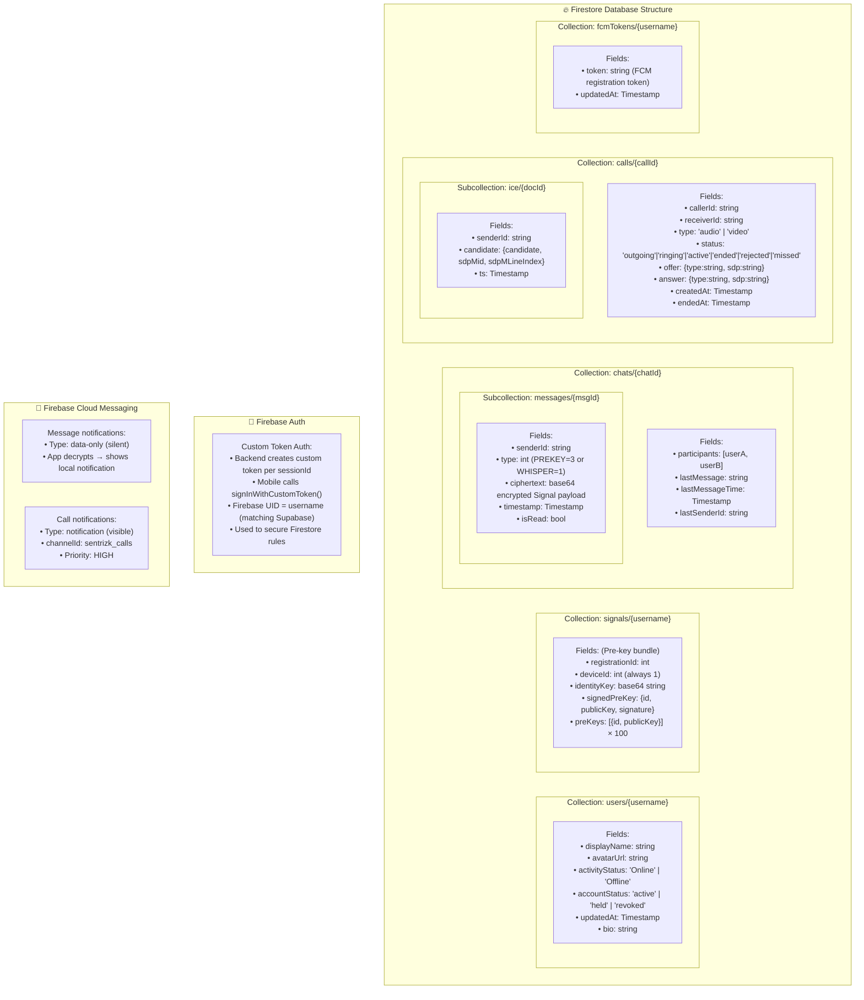
```mermaid
graph TB
    subgraph FIRESTORE["🔥 Firestore Database Structure"]
        
        subgraph COL_USERS["Collection: users/{username}"]
            U_FIELDS["Fields:\n• displayName: string\n• avatarUrl: string\n• activityStatus: 'Online' | 'Offline'\n• accountStatus: 'active' | 'held' | 'revoked'\n• updatedAt: Timestamp\n• bio: string"]
        end
        
        subgraph COL_SIGNALS["Collection: signals/{username}"]
            S_FIELDS["Fields: (Pre-key bundle)\n• registrationId: int\n• deviceId: int (always 1)\n• identityKey: base64 string\n• signedPreKey: {id, publicKey, signature}\n• preKeys: [{id, publicKey}] × 100"]
        end
        
        subgraph COL_CHATS["Collection: chats/{chatId}"]
            CH_FIELDS["Fields:\n• participants: [userA, userB]\n• lastMessage: string\n• lastMessageTime: Timestamp\n• lastSenderId: string"]
            
            subgraph COL_MSGS["Subcollection: messages/{msgId}"]
                M_FIELDS["Fields:\n• senderId: string\n• type: int (PREKEY=3 or WHISPER=1)\n• ciphertext: base64 encrypted Signal payload\n• timestamp: Timestamp\n• isRead: bool"]
            end
        end
        
        subgraph COL_CALLS["Collection: calls/{callId}"]
            CA_FIELDS["Fields:\n• callerId: string\n• receiverId: string\n• type: 'audio' | 'video'\n• status: 'outgoing'|'ringing'|'active'|'ended'|'rejected'|'missed'\n• offer: {type:string, sdp:string}\n• answer: {type:string, sdp:string}\n• createdAt: Timestamp\n• endedAt: Timestamp"]
            
            subgraph COL_ICE["Subcollection: ice/{docId}"]
                I_FIELDS["Fields:\n• senderId: string\n• candidate: {candidate, sdpMid, sdpMLineIndex}\n• ts: Timestamp"]
            end
        end
        
        subgraph COL_FCM["Collection: fcmTokens/{username}"]
            F_FIELDS["Fields:\n• token: string (FCM registration token)\n• updatedAt: Timestamp"]
        end
    end

    subgraph FIREBASE_AUTH["🔑 Firebase Auth"]
        FA_NOTE["Custom Token Auth:\n• Backend creates custom token per sessionId\n• Mobile calls signInWithCustomToken()\n• Firebase UID = username (matching Supabase)\n• Used to secure Firestore rules"]
    end

    subgraph FIREBASE_FCM["📲 Firebase Cloud Messaging"]
        FCM_MSG["Message notifications:\n• Type: data-only (silent)\n• App decrypts → shows local notification"]
        FCM_CALL["Call notifications:\n• Type: notification (visible)\n• channelId: sentrizk_calls\n• Priority: HIGH"]
    end
```

---

## A7. TFLite ML Threat Detection Pipeline

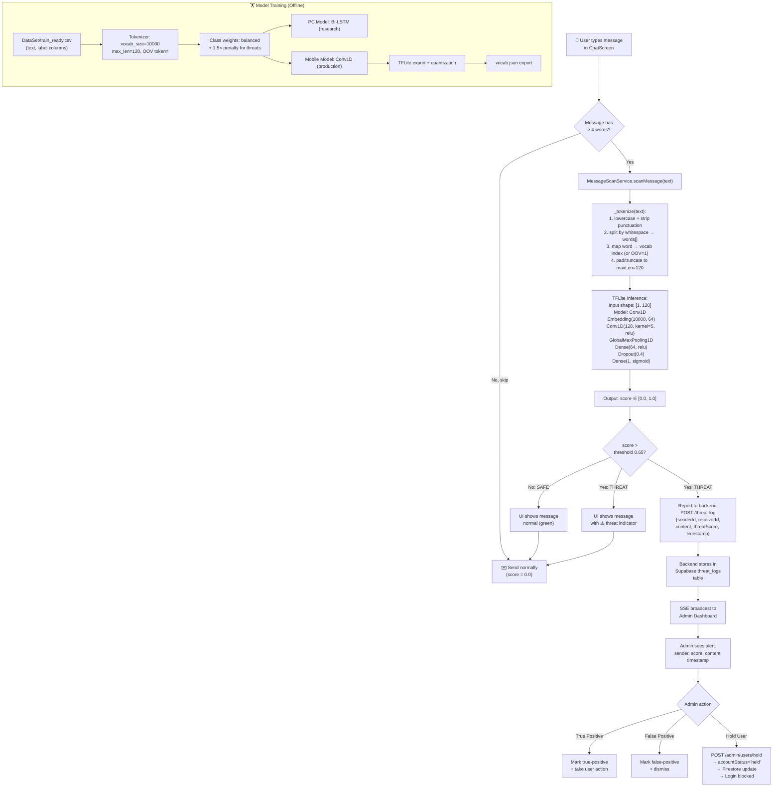
```mermaid
flowchart TD
    A["📝 User types message<br/>in ChatScreen"] --> B{Message has<br/>≥ 4 words?}
    B -->|No, skip| Z_SEND["✉️ Send normally\n(score = 0.0)"]
    B -->|Yes| C["MessageScanService.scanMessage(text)"]
    
    C --> D["_tokenize(text):<br/>1. lowercase + strip punctuation<br/>2. split by whitespace → words[]<br/>3. map word → vocab index (or OOV=1)<br/>4. pad/truncate to maxLen=120"]
    
    D --> E["TFLite Inference:<br/>Input shape: [1, 120]<br/>Model: Conv1D<br/>  Embedding(10000, 64)<br/>  Conv1D(128, kernel=5, relu)<br/>  GlobalMaxPooling1D<br/>  Dense(64, relu)<br/>  Dropout(0.4)<br/>  Dense(1, sigmoid)"]
    
    E --> F["Output: score ∈ [0.0, 1.0]"]
    
    F --> G{score ><br/>threshold 0.65?}
    
    G -->|Yes: THREAT| H["Report to backend:\nPOST /threat-log<br/>{senderId, receiverId,<br/>content, threatScore, timestamp}"]
    
    H --> I["Backend stores in<br/>Supabase threat_logs<br/>table"]
    
    I --> J["SSE broadcast to<br/>Admin Dashboard"]
    
    J --> K["Admin sees alert:<br/>sender, score, content,<br/>timestamp"]
    
    K --> L{Admin action}
    L -->|True Positive| M["Mark true-positive<br/>+ take user action"]
    L -->|False Positive| N["Mark false-positive<br/>+ dismiss"]
    L -->|Hold User| O["POST /admin/users/hold<br/>→ accountStatus='held'<br/>→ Firestore update<br/>→ Login blocked"]
    
    G -->|No: SAFE| P["UI shows message\nnormal (green)"]
    G -->|Yes: THREAT| Q["UI shows message\nwith ⚠️ threat indicator"]
    
    Z_SEND
    P --> Z_SEND
    Q --> Z_SEND
    
    subgraph ML_TRAINING["🏋️ Model Training (Offline)"]
        T1["DataSet/train_ready.csv\n(text, label columns)"]
        T2["Tokenizer: vocab_size=10000\nmax_len=120, OOV token=<OOV>"]
        T3["Class weights: balanced\n+ 1.5× penalty for threats"]
        T4["PC Model: Bi-LSTM (research)"]
        T5["Mobile Model: Conv1D (production)"]
        T6["TFLite export + quantization"]
        T7["vocab.json export"]
        T1 --> T2 --> T3
        T3 --> T4
        T3 --> T5
        T5 --> T6 --> T7
    end
```

---

## A8. Admin Panel — Complete Feature Map

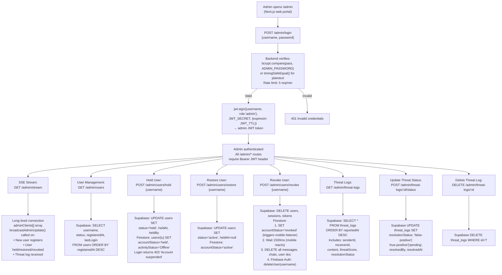
```mermaid
flowchart TD
    A["Admin opens /admin<br/>(Next.js web portal)"] --> B["POST /admin/login<br/>{username, password}"]
    
    B --> C["Backend verifies:<br/>bcrypt.compare(pass, ADMIN_PASSWORD)\nor timingSafeEqual() for plaintext<br/>Rate limit: 5 req/min"]
    
    C -->|Valid| D["jwt.sign({username, role:'admin'},<br/>JWT_SECRET, {expiresIn: JWT_TTL})<br/>→ admin JWT token"]
    C -->|Invalid| E["401 Invalid credentials"]
    
    D --> F["Admin authenticated<br/>All /admin/* routes<br/>require Bearer JWT header"]
    
    F --> G["SSE Stream:\nGET /admin/stream"]
    G --> H["Long-lived connection<br/>adminClients[] array<br/>broadcastAdminUpdate() called on:<br/>• New user registers<br/>• User held/restored/revoked<br/>• Threat log received"]
    
    F --> I["User Management:\nGET /admin/users"]
    I --> J["Supabase: SELECT username,<br/>status, registeredAt, lastLogin<br/>FROM users ORDER BY registeredAt DESC"]
    
    F --> K["Hold User:\nPOST /admin/users/hold {username}"]
    K --> L["Supabase: UPDATE users SET<br/>status='held', heldAt, heldBy<br/>Firestore: users/{u} SET<br/>accountStatus='held', activityStatus='Offline'<br/>Login returns 403 'Account suspended'"]
    
    F --> M["Restore User:\nPOST /admin/users/restore {username}"]
    M --> N["Supabase: UPDATE users SET<br/>status='active', heldAt=null<br/>Firestore: accountStatus='active'"]
    
    F --> O["Revoke User:\nPOST /admin/users/revoke {username}"]
    O --> P["Supabase: DELETE users, sessions, tokens\nFirestore:\n1. SET accountStatus='revoked' (triggers mobile listener)\n2. Wait 1500ms (mobile reacts)\n3. DELETE all messages, chats, user doc\n4. Firebase Auth: deleteUser(username)"]
    
    F --> Q["Threat Logs:\nGET /admin/threat-logs"]
    Q --> R["Supabase: SELECT * FROM threat_logs<br/>ORDER BY reportedAt DESC\nIncludes: senderId, receiverId,<br/>content, threatScore, resolutionStatus"]
    
    F --> S["Update Threat Status:\nPOST /admin/threat-logs/:id/status"]
    S --> T["Supabase UPDATE threat_logs SET<br/>resolutionStatus: 'false-positive'|<br/>'true-positive'|'pending',<br/>resolvedBy, resolvedAt"]
    
    F --> U["Delete Threat Log:\nDELETE /admin/threat-logs/:id"]
    U --> V["Supabase DELETE threat_logs WHERE id=?"]
```

---

## A9. Session Lifecycle & Security

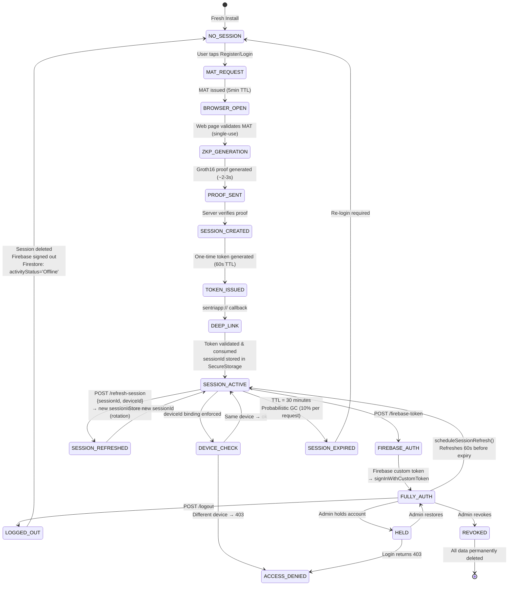
```mermaid
stateDiagram-v2
    [*] --> NO_SESSION : Fresh Install
    
    NO_SESSION --> MAT_REQUEST : User taps Register/Login
    MAT_REQUEST --> BROWSER_OPEN : MAT issued (5min TTL)
    BROWSER_OPEN --> ZKP_GENERATION : Web page validates MAT (single-use)
    ZKP_GENERATION --> PROOF_SENT : Groth16 proof generated (~2-3s)
    PROOF_SENT --> SESSION_CREATED : Server verifies proof
    SESSION_CREATED --> TOKEN_ISSUED : One-time token generated (60s TTL)
    TOKEN_ISSUED --> DEEP_LINK : sentriapp:// callback
    DEEP_LINK --> SESSION_ACTIVE : Token validated & consumed<br/>sessionId stored in SecureStorage
    
    SESSION_ACTIVE --> FIREBASE_AUTH : POST /firebase-token
    FIREBASE_AUTH --> FULLY_AUTH : Firebase custom token<br/>→ signInWithCustomToken
    
    FULLY_AUTH --> SESSION_ACTIVE : scheduleSessionRefresh()<br/>Refreshes 60s before expiry
    
    SESSION_ACTIVE --> SESSION_REFRESHED : POST /refresh-session<br/>{sessionId, deviceId}<br/>→ new sessionId issued (rotation)
    SESSION_REFRESHED --> SESSION_ACTIVE : Store new sessionId
    
    SESSION_ACTIVE --> DEVICE_CHECK : deviceId binding enforced
    DEVICE_CHECK --> ACCESS_DENIED : Different device → 403
    DEVICE_CHECK --> SESSION_ACTIVE : Same device → ok
    
    SESSION_ACTIVE --> SESSION_EXPIRED : TTL = 30 minutes<br/>Probabilistic GC (10% per request)
    SESSION_EXPIRED --> NO_SESSION : Re-login required
    
    FULLY_AUTH --> LOGGED_OUT : POST /logout
    LOGGED_OUT --> NO_SESSION : Session deleted<br/>Firebase signed out<br/>Firestore: activityStatus='Offline'
    
    FULLY_AUTH --> HELD : Admin holds account
    HELD --> ACCESS_DENIED : Login returns 403
    HELD --> FULLY_AUTH : Admin restores
    
    FULLY_AUTH --> REVOKED : Admin revokes
    REVOKED --> [*] : All data permanently deleted
```

---

## A10. Cryptographic Stack Summary

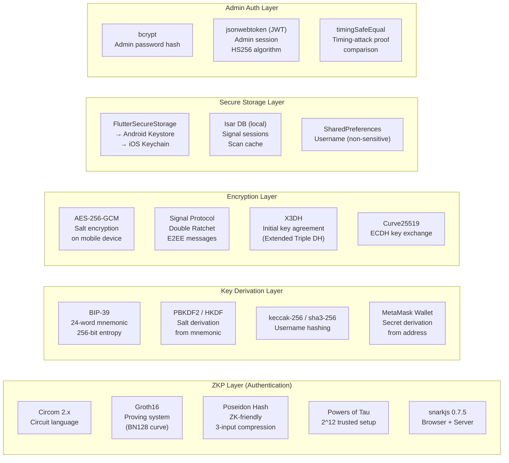
```mermaid
graph LR
    subgraph ZKP_LAYER["ZKP Layer (Authentication)"]
        ZKP1["Circom 2.x\nCircuit language"]
        ZKP2["Groth16\nProving system\n(BN128 curve)"]
        ZKP3["Poseidon Hash\nZK-friendly\n3-input compression"]
        ZKP4["Powers of Tau\n2^12 trusted setup"]
        ZKP5["snarkjs 0.7.5\nBrowser + Server"]
    end

    subgraph KEY_LAYER["Key Derivation Layer"]
        K1["BIP-39\n24-word mnemonic\n256-bit entropy"]
        K2["PBKDF2 / HKDF\nSalt derivation\nfrom mnemonic"]
        K3["keccak-256 / sha3-256\nUsername hashing"]
        K4["MetaMask Wallet\nSecret derivation\nfrom address"]
    end

    subgraph ENCRYPT_LAYER["Encryption Layer"]
        E1["AES-256-GCM\nSalt encryption\non mobile device"]
        E2["Signal Protocol\nDouble Ratchet\nE2EE messages"]
        E3["X3DH\nInitial key agreement\n(Extended Triple DH)"]
        E4["Curve25519\nECDH key exchange"]
    end

    subgraph STORAGE_LAYER["Secure Storage Layer"]
        S1["FlutterSecureStorage\n→ Android Keystore\n→ iOS Keychain"]
        S2["Isar DB (local)\nSignal sessions\nScan cache"]
        S3["SharedPreferences\nUsername (non-sensitive)"]
    end

    subgraph ADMIN_LAYER["Admin Auth Layer"]
        A1["bcrypt\nAdmin password hash"]
        A2["jsonwebtoken (JWT)\nAdmin session\nHS256 algorithm"]
        A3["timingSafeEqual\nTiming-attack proof\ncomparison"]
    end
```

---
---

# PART B — EXAMPLE-ANNOTATED WALKTHROUGH DIAGRAMS
*(Same system, with real values and analogies for easy explanation)*

---

## B1. System Architecture — With Technology Labels

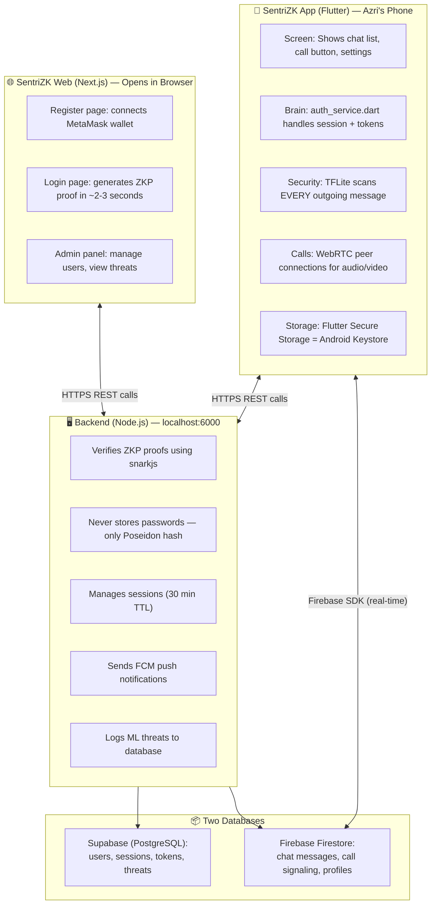
```mermaid
graph TB
    subgraph MOBILE["📱 SentriZK App (Flutter) — Azri's Phone"]
        M1["Screen: Shows chat list, call button, settings"]
        M2["Brain: auth_service.dart handles session + tokens"]
        M3["Security: TFLite scans EVERY outgoing message"]
        M4["Calls: WebRTC peer connections for audio/video"]
        M5["Storage: Flutter Secure Storage = Android Keystore"]
    end

    subgraph WEB["🌐 SentriZK Web (Next.js) — Opens in Browser"]
        W1["Register page: connects MetaMask wallet"]
        W2["Login page: generates ZKP proof in ~2-3 seconds"]
        W3["Admin panel: manage users, view threats"]
    end

    subgraph SERVER["🖥️ Backend (Node.js) — localhost:6000"]
        S1["Verifies ZKP proofs using snarkjs"]
        S2["Never stores passwords — only Poseidon hash"]
        S3["Manages sessions (30 min TTL)"]
        S4["Sends FCM push notifications"]
        S5["Logs ML threats to database"]
    end

    subgraph DBS["📦 Two Databases"]
        D1["Supabase (PostgreSQL):\nusers, sessions, tokens, threats"]
        D2["Firebase Firestore:\nchat messages, call signaling, profiles"]
    end

    MOBILE <-->|"HTTPS REST calls"| SERVER
    WEB <-->|"HTTPS REST calls"| SERVER
    SERVER --> D1
    SERVER --> D2
    MOBILE <-->|"Firebase SDK (real-time)"| D2
```

---

## B2. Registration — Step-by-Step with Real Values

> **Scenario:** Azri creates a new SentriZK account using username `azri_bcss`

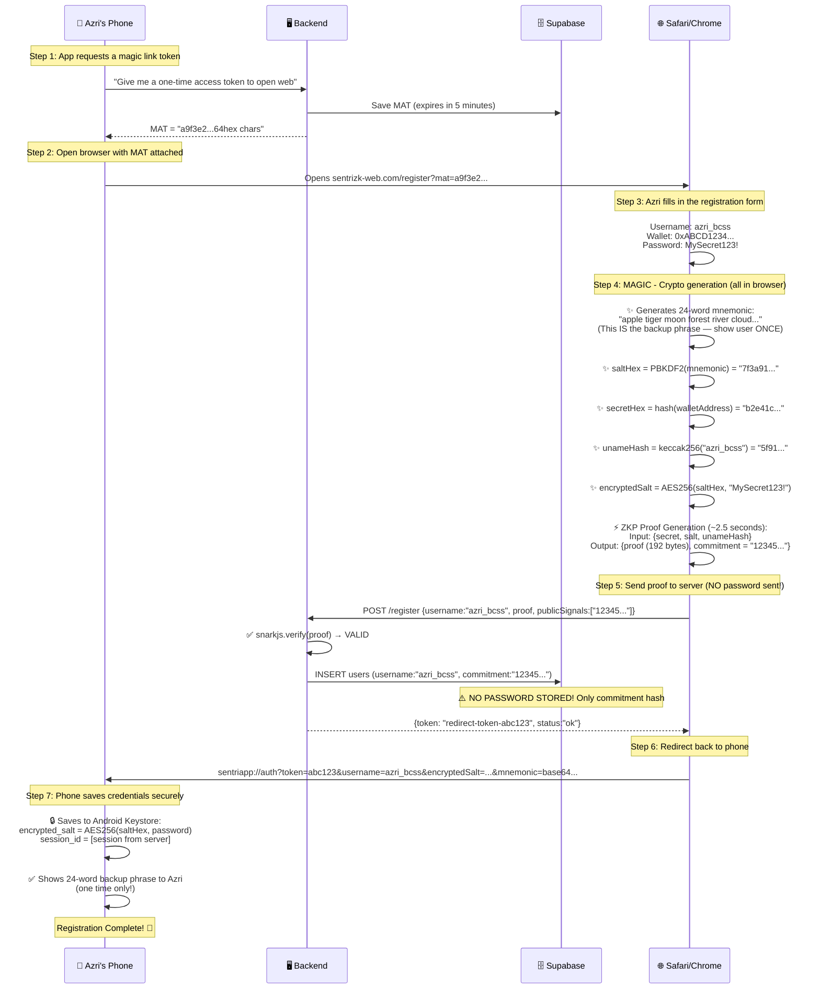
```mermaid
sequenceDiagram
    participant PHONE as 📱 Azri's Phone
    participant SERVER as 🖥️ Backend
    participant DB as 🗄️ Supabase
    participant BROWSER as 🌐 Safari/Chrome

    Note over PHONE: Step 1: App requests a magic link token
    PHONE->>SERVER: "Give me a one-time access token to open web"
    SERVER->>DB: Save MAT (expires in 5 minutes)
    SERVER-->>PHONE: MAT = "a9f3e2...64hex chars"

    Note over PHONE: Step 2: Open browser with MAT attached
    PHONE->>BROWSER: Opens sentrizk-web.com/register?mat=a9f3e2...

    Note over BROWSER: Step 3: Azri fills in the registration form
    BROWSER->>BROWSER: Username: azri_bcss<br/>Wallet: 0xABCD1234...<br/>Password: MySecret123!

    Note over BROWSER: Step 4: MAGIC - Crypto generation (all in browser)
    BROWSER->>BROWSER: ✨ Generates 24-word mnemonic:<br/>"apple tiger moon forest river cloud..."<br/>(This IS the backup phrase — show user ONCE)
    BROWSER->>BROWSER: ✨ saltHex = PBKDF2(mnemonic) = "7f3a91..."
    BROWSER->>BROWSER: ✨ secretHex = hash(walletAddress) = "b2e41c..."
    BROWSER->>BROWSER: ✨ unameHash = keccak256("azri_bcss") = "5f91..."
    BROWSER->>BROWSER: ✨ encryptedSalt = AES256(saltHex, "MySecret123!")
    BROWSER->>BROWSER: ⚡ ZKP Proof Generation (~2.5 seconds):<br/>Input: {secret, salt, unameHash}<br/>Output: {proof (192 bytes), commitment = "12345..."}

    Note over BROWSER: Step 5: Send proof to server (NO password sent!)
    BROWSER->>SERVER: POST /register {username:"azri_bcss", proof, publicSignals:["12345..."]}
    SERVER->>SERVER: ✅ snarkjs.verify(proof) → VALID
    SERVER->>DB: INSERT users (username:"azri_bcss", commitment:"12345...")
    Note over DB: ⚠️ NO PASSWORD STORED! Only commitment hash
    SERVER-->>BROWSER: {token: "redirect-token-abc123", status:"ok"}

    Note over BROWSER: Step 6: Redirect back to phone
    BROWSER->>PHONE: sentriapp://auth?token=abc123&username=azri_bcss&encryptedSalt=...&mnemonic=base64...

    Note over PHONE: Step 7: Phone saves credentials securely
    PHONE->>PHONE: 🔒 Saves to Android Keystore:<br/>encrypted_salt = AES256(saltHex, password)<br/>session_id = [session from server]
    PHONE->>PHONE: ✅ Shows 24-word backup phrase to Azri<br/>(one time only!)
    Note over PHONE: Registration Complete! 🎉
```

---

## B3. Login — Step-by-Step with Real Values

> **Scenario:** Azri locks his phone, unlocks it next morning — needs to prove it's still him

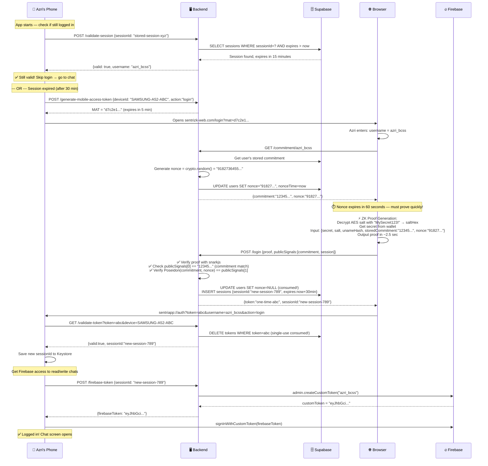
```mermaid
sequenceDiagram
    participant PHONE as 📱 Azri's Phone
    participant SERVER as 🖥️ Backend  
    participant DB as 🗄️ Supabase
    participant BROWSER as 🌐 Browser
    participant FIREBASE as 🔥 Firebase

    Note over PHONE: App starts — check if still logged in
    PHONE->>SERVER: POST /validate-session {sessionId: "stored-session-xyz"}
    SERVER->>DB: SELECT sessions WHERE sessionId=? AND expires > now
    DB-->>SERVER: Session found, expires in 15 minutes
    SERVER-->>PHONE: {valid: true, username: "azri_bcss"}
    Note over PHONE: ✅ Still valid! Skip login → go to chat

    Note over PHONE: --- OR --- Session expired (after 30 min)
    PHONE->>SERVER: POST /generate-mobile-access-token {deviceId: "SAMSUNG-A52-ABC", action:"login"}
    SERVER-->>PHONE: MAT = "d7c2e1..." (expires in 5 min)
    PHONE->>BROWSER: Opens sentrizk-web.com/login?mat=d7c2e1...

    BROWSER->>BROWSER: Azri enters: username = azri_bcss
    BROWSER->>SERVER: GET /commitment/azri_bcss
    SERVER->>DB: Get user's stored commitment
    SERVER->>SERVER: Generate nonce = crypto.random() = "9182736455..."
    SERVER->>DB: UPDATE users SET nonce="91827...", nonceTime=now
    SERVER-->>BROWSER: {commitment:"12345...", nonce:"91827..."}
    Note over BROWSER: ⏱️ Nonce expires in 60 seconds — must prove quickly!

    BROWSER->>BROWSER: ⚡ ZK Proof Generation:<br/>Decrypt AES salt with "MySecret123!" → saltHex<br/>Get secret from wallet<br/>Input: {secret, salt, unameHash, storedCommitment:"12345...", nonce:"91827..."}<br/>Output proof in ~2.5 sec

    BROWSER->>SERVER: POST /login {proof, publicSignals:[commitment, session]}
    SERVER->>SERVER: ✅ Verify proof with snarkjs<br/>✅ Check publicSignals[0] == "12345..." (commitment match)<br/>✅ Verify Poseidon(commitment, nonce) == publicSignals[1]
    SERVER->>DB: UPDATE users SET nonce=NULL (consumed!)<br/>INSERT sessions {sessionId:"new-session-789", expires:now+30min}
    SERVER-->>BROWSER: {token:"one-time-abc", sessionId:"new-session-789"}

    BROWSER->>PHONE: sentriapp://auth?token=abc&username=azri_bcss&action=login
    PHONE->>SERVER: GET /validate-token?token=abc&device=SAMSUNG-A52-ABC
    SERVER->>DB: DELETE tokens WHERE token=abc (single-use consumed!)
    SERVER-->>PHONE: {valid:true, sessionId:"new-session-789"}
    PHONE->>PHONE: Save new sessionId to Keystore

    Note over PHONE: Get Firebase access to read/write chats
    PHONE->>SERVER: POST /firebase-token {sessionId: "new-session-789"}
    SERVER->>FIREBASE: admin.createCustomToken("azri_bcss")
    FIREBASE-->>SERVER: customToken = "eyJhbGci..."
    SERVER-->>PHONE: {firebaseToken: "eyJhbGci..."}
    PHONE->>FIREBASE: signInWithCustomToken(firebaseToken)
    Note over PHONE: ✅ Logged in! Chat screen opens
```

---

## B4. E2EE Messaging — With Analogy Explanation

> **Analogy:** Think of Signal Protocol like a combination lock that changes its code after every use. Even if someone records ALL your encrypted messages, they can't decrypt them later.

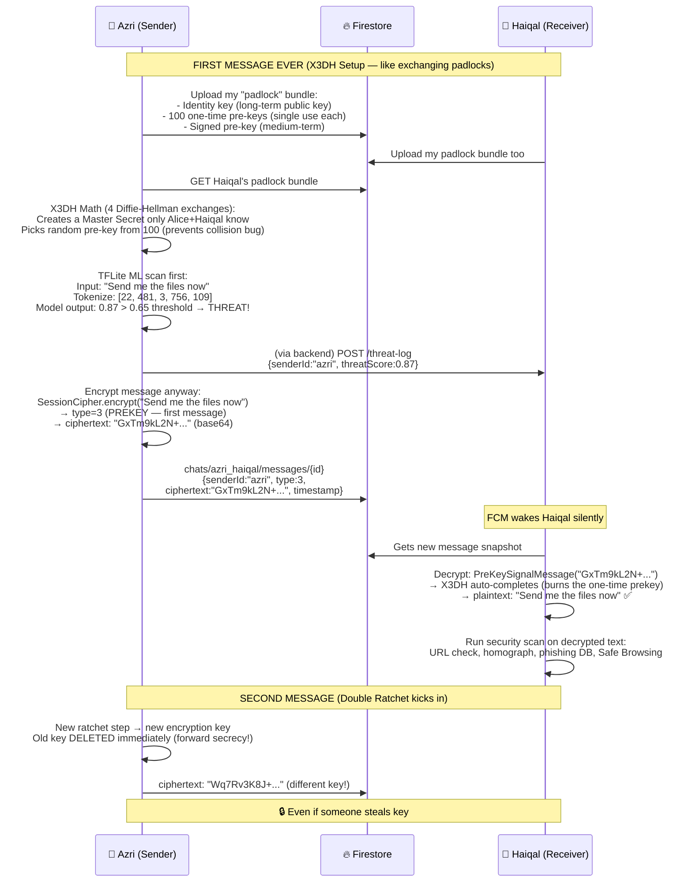
```mermaid
sequenceDiagram
    participant AZRI as 📱 Azri (Sender)
    participant FIRESTORE as 🔥 Firestore
    participant HAIQAL as 📱 Haiqal (Receiver)

    Note over AZRI,HAIQAL: FIRST MESSAGE EVER (X3DH Setup — like exchanging padlocks)

    AZRI->>FIRESTORE: Upload my "padlock" bundle:<br/>- Identity key (long-term public key)<br/>- 100 one-time pre-keys (single use each)<br/>- Signed pre-key (medium-term)
    
    HAIQAL->>FIRESTORE: Upload my padlock bundle too

    AZRI->>FIRESTORE: GET Haiqal's padlock bundle
    AZRI->>AZRI: X3DH Math (4 Diffie-Hellman exchanges):<br/>Creates a Master Secret only Alice+Haiqal know<br/>Picks random pre-key from 100 (prevents collision bug)

    AZRI->>AZRI: TFLite ML scan first:<br/>Input: "Send me the files now"<br/>Tokenize: [22, 481, 3, 756, 109]<br/>Model output: 0.87 > 0.65 threshold → THREAT!
    
    AZRI->>HAIQAL: (via backend) POST /threat-log<br/>{senderId:"azri", threatScore:0.87}
    
    AZRI->>AZRI: Encrypt message anyway:<br/>SessionCipher.encrypt("Send me the files now")<br/>→ type=3 (PREKEY — first message)<br/>→ ciphertext: "GxTm9kL2N+..." (base64)

    AZRI->>FIRESTORE: chats/azri_haiqal/messages/{id}<br/>{senderId:"azri", type:3,<br/>ciphertext:"GxTm9kL2N+...", timestamp}

    Note over HAIQAL: FCM wakes Haiqal silently
    HAIQAL->>FIRESTORE: Gets new message snapshot
    HAIQAL->>HAIQAL: Decrypt: PreKeySignalMessage("GxTm9kL2N+...")<br/>→ X3DH auto-completes (burns the one-time prekey)<br/>→ plaintext: "Send me the files now" ✅
    HAIQAL->>HAIQAL: Run security scan on decrypted text:<br/>URL check, homograph, phishing DB, Safe Browsing

    Note over AZRI,HAIQAL: SECOND MESSAGE (Double Ratchet kicks in)
    AZRI->>AZRI: New ratchet step → new encryption key<br/>Old key DELETED immediately (forward secrecy!)
    AZRI->>FIRESTORE: ciphertext: "Wq7Rv3K8J+..." (different key!)
    
    Note over AZRI,HAIQAL: 🔒 Even if someone steals key #2,<br/>they CANNOT decrypt message #1 (already deleted)
```

---

## B5. WebRTC Call — With Timeline

> **Scenario:** Azri video calls Haiqal. Step-by-step what happens in real-time.

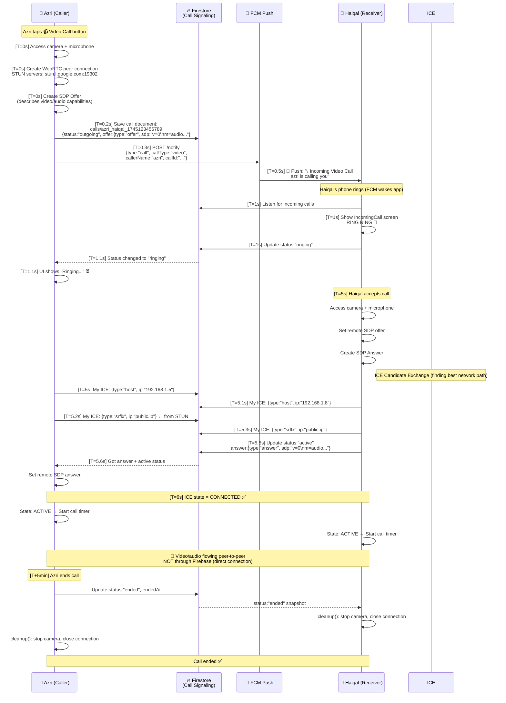
```mermaid
sequenceDiagram
    participant A as 📱 Azri (Caller)
    participant FS as 🔥 Firestore<br/>(Call Signaling)
    participant FCM as 📲 FCM Push
    participant H as 📱 Haiqal (Receiver)

    Note over A: Azri taps 📹 Video Call button
    
    A->>A: [T=0s] Access camera + microphone
    A->>A: [T=0s] Create WebRTC peer connection<br/>STUN servers: stun.l.google.com:19302

    A->>A: [T=0s] Create SDP Offer<br/>(describes video/audio capabilities)

    A->>FS: [T=0.2s] Save call document:<br/>calls/azri_haiqal_1745123456789<br/>{status:"outgoing", offer:{type:"offer", sdp:"v=0\nm=audio..."}

    A->>FCM: [T=0.3s] POST /notify<br/>{type:"call", callType:"video",<br/>callerName:"azri", callId:"..."}
    FCM->>H: [T=0.5s] 📲 Push: "📞 Incoming Video Call<br/>azri is calling you"

    Note over H: Haiqal's phone rings (FCM wakes app)
    H->>FS: [T=1s] Listen for incoming calls
    H->>H: [T=1s] Show IncomingCall screen<br/>RING RING 🔔
    H->>FS: [T=1s] Update status:"ringing"
    FS-->>A: [T=1.1s] Status changed to "ringing"
    A->>A: [T=1.1s] UI shows "Ringing..." ⏳

    Note over H: [T=5s] Haiqal accepts call
    H->>H: Access camera + microphone
    H->>H: Set remote SDP offer
    H->>H: Create SDP Answer

    Note over ICE: ICE Candidate Exchange (finding best network path)
    A->>FS: [T=5s] My ICE: {type:"host", ip:"192.168.1.5"}
    H->>FS: [T=5.1s] My ICE: {type:"host", ip:"192.168.1.8"}
    A->>FS: [T=5.2s] My ICE: {type:"srflx", ip:"public.ip"} ← from STUN
    H->>FS: [T=5.3s] My ICE: {type:"srflx", ip:"public.ip"}

    H->>FS: [T=5.5s] Update status:"active"<br/>answer:{type:"answer", sdp:"v=0\nm=audio..."}
    FS-->>A: [T=5.6s] Got answer + active status
    A->>A: Set remote SDP answer

    Note over A,H: [T=6s] ICE state = CONNECTED ✅
    A->>A: State: ACTIVE → Start call timer
    H->>H: State: ACTIVE → Start call timer

    Note over A,H: 🎥 Video/audio flowing peer-to-peer<br/>NOT through Firebase (direct connection)

    Note over A: [T+5min] Azri ends call
    A->>FS: Update status:"ended", endedAt
    FS-->>H: status:"ended" snapshot
    H->>H: cleanup(): stop camera, close connection
    A->>A: cleanup(): stop camera, close connection
    Note over A,H: Call ended ✅
```

---

## B6. ML Threat Detection — Visual Pipeline

> **Example:** Employee sends "I will leak all the data to competitors tonight"

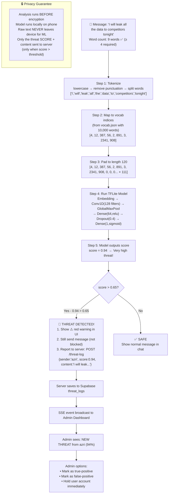
```mermaid
flowchart TD
    A["💬 Message: 'I will leak all the data to competitors tonight'<br/>Word count: 9 words ✅ (≥ 4 required)"] 

    B["Step 1: Tokenize<br/>lowercase → remove punctuation → split words<br/>['i','will','leak','all','the','data','to','competitors','tonight']"]

    C["Step 2: Map to vocab indices<br/>(from vocab.json with 10,000 words)<br/>[4, 12, 387, 56, 2, 891, 3, 2341, 908]"]

    D["Step 3: Pad to length 120<br/>[4, 12, 387, 56, 2, 891, 3, 2341, 908, 0, 0, 0... × 111]"]

    E["Step 4: Run TFLite Model<br/>Embedding → Conv1D(128 filters) → GlobalMaxPool<br/>→ Dense(64,relu) → Dropout(0.4) → Dense(1,sigmoid)"]

    F["Step 5: Model outputs score<br/>score = 0.94  ← Very high threat!"]

    G{score > 0.65?}

    H_YES["🚨 THREAT DETECTED!<br/>1. Show ⚠️ red warning in UI<br/>2. Still send message (not blocked)<br/>3. Report to server: POST /threat-log<br/>   {sender:'azri', score:0.94, content:'I will leak...'}"]

    H_NO["✅ SAFE<br/>Show normal message in chat"]

    I["Server saves to Supabase threat_logs"]
    J["SSE event broadcast to Admin Dashboard"]
    K["Admin sees: NEW THREAT from azri (94%)"]
    L["Admin options:<br/>• Mark as true-positive<br/>• Mark as false-positive<br/>• Hold user account immediately"]

    A --> B --> C --> D --> E --> F --> G
    G -->|Yes - 0.94 > 0.65| H_YES
    G -->|No| H_NO
    H_YES --> I --> J --> K --> L

    subgraph PRIVACY["🔒 Privacy Guarantee"]
        P1["Analysis runs BEFORE encryption<br/>Model runs locally on phone<br/>Raw text NEVER leaves device for ML<br/>Only the threat SCORE + content sent to server<br/>(only when score > threshold)"]
    end
```

---

## B7. Admin Panel — What Admin Can Do

```mermaid
flowchart LR
    ADMIN["👮 Admin Logs In\nusername + password\n(bcrypt verified)\nGets JWT token (1 hour)"]

    subgraph ACTIONS["Admin Dashboard Actions"]
        A1["👥 View All Users\n• username\n• status (active/held/revoked)\n• registered date\n• last login time"]

        A2["🔒 Hold User\nAccount suspended\nCan't log in\nFirestore set Offline\nReason: Suspicious activity"]

        A3["✅ Restore User\nAccount re-activated\nCan log in again"]

        A4["🗑️ Revoke User\n• Delete from DB\n• Delete all sessions\n• Delete all messages\n• Delete Firebase account\n• PERMANENT, cannot undo"]

        A5["🚨 View Threat Logs\n• Who sent it\n• Message content\n• Threat score (0.0-1.0)\n• Time of detection"]

        A6["📊 Mark Log Status\n• true-positive (real threat)\n• false-positive (false alarm)\n• pending (investigating)"]

        A7["📡 Real-time SSE Stream\nDashboard auto-refreshes when:\n• New user registers\n• New threat detected\n• User held/revoked"]
    end

    ADMIN --> ACTIONS

    subgraph SECURITY["🔐 Admin Security"]
        S1["Rate limit: 5 req/min on /admin/login"]
        S2["JWT expires: 1 hour (configurable)"]
        S3["All admin actions logged to console"]
        S4["timingSafeEqual prevents timing attacks"]
    end
```

---

## B8. Security Defense Matrix — Explained Simply

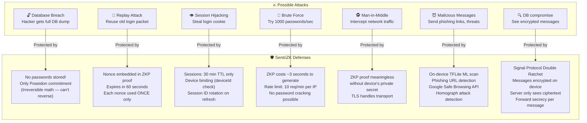
```mermaid
graph TD
    subgraph ATTACKS["⚔️ Possible Attacks"]
        AT1["🔓 Database Breach\nHacker gets full DB dump"]
        AT2["🔄 Replay Attack\nReuse old login packet"]
        AT3["👁️ Session Hijacking\nSteal login cookie"]
        AT4["💪 Brute Force\nTry 1000 passwords/sec"]
        AT5["🕵️ Man-in-Middle\nIntercept network traffic"]
        AT6["😈 Malicious Messages\nSend phishing links, threats"]
        AT7["🔍 DB compromise\nSee encrypted messages"]
    end

    subgraph DEFENSES["🛡️ SentriZK Defenses"]
        D1["No passwords stored!\nOnly Poseidon commitment\n(Irreversible math — can't reverse)"]
        D2["Nonce embedded in ZKP proof\nExpires in 60 seconds\nEach nonce used ONCE only"]
        D3["Sessions: 30 min TTL only\nDevice binding (deviceId check)\nSession ID rotation on refresh"]
        D4["ZKP costs ~3 seconds to generate\nRate limit: 10 req/min per IP\nNo password cracking possible"]
        D5["ZKP proof meaningless\nwithout device's private secret\nTLS handles transport"]
        D6["On-device TFLite ML scan\nPhishing URL detection\nGoogle Safe Browsing API\nHomograph attack detection"]
        D7["Signal Protocol Double Ratchet\nMessages encrypted on device\nServer only sees ciphertext\nForward secrecy per message"]
    end

    AT1 -->|Protected by| D1
    AT2 -->|Protected by| D2
    AT3 -->|Protected by| D3
    AT4 -->|Protected by| D4
    AT5 -->|Protected by| D5
    AT6 -->|Protected by| D6
    AT7 -->|Protected by| D7
```

---

## B9. Key Performance Numbers (Quick Reference)

| Component | Metric | Value | Where in Code |
|-----------|--------|-------|---------------|
| ZKP Proof Generation | Time (browser) | ~2–3 seconds | `snarkjs.groth16.fullProve()` |
| ZKP Proof Verification | Time (server) | < 50 ms | `snarkjs.groth16.verify()` |
| ZKP Proof Size | Bytes | 192 bytes compressed | Groth16 output |
| Registration Circuit | Constraints | 1,247 | `registration.circom` |
| Login Circuit | Constraints | 1,486 | `login.circom` |
| Session TTL | Minutes | 30 min | `SESSION_TTL = 30 * 60 * 1000` |
| Nonce TTL | Seconds | 60 sec | `NONCE_TTL = 60 * 1000` |
| MAT TTL | Minutes | 5 min | `MOBILE_ACCESS_TOKEN_TTL = 5 * 60 * 1000` |
| ML Inference Time | Milliseconds | < 100 ms | TFLite Flutter |
| ML Threat Threshold | Score | 0.65 | `AppConfig.mlThreatThreshold` |
| ML Vocab Size | Words | 10,000 | `VOCAB_SIZE = 10000` |
| ML Max Sequence Length | Tokens | 120 | `MAX_LEN = 120` |
| ML Min Message Words | Words | 4 words | `AppConfig.mlMinWordCount` |
| PreKey Bundle Size | Keys | 100 one-time keys | `generatePreKeys(0, 100)` |
| Rate Limit — Auth | Req/min | 10 req/min | `RATE_LIMIT_MAX = 10` |
| Rate Limit — Admin | Req/min | 5 req/min | `rateLimit({max: 5})` |
| Missed Call Timer | Seconds | 45 seconds | `Timer(Duration(seconds: 45))` |
| Admin JWT TTL | Hours | 1h (configurable) | `JWT_TTL = process.env.JWT_TTL` |
| Session Refresh Offset | Seconds | 60s before expiry | `scheduleSessionRefresh()` |
| AES Salt Encryption | Key size | 256-bit GCM | `encryptSaltHex()` |
| Entropy (BIP-39) | Bits | 256-bit | `generateRecoveryPhrase()` |
| Security Level (ZKP) | Bits | 128-bit | BN128 elliptic curve |

---

## B10. Complete Data Flow — One Page Summary

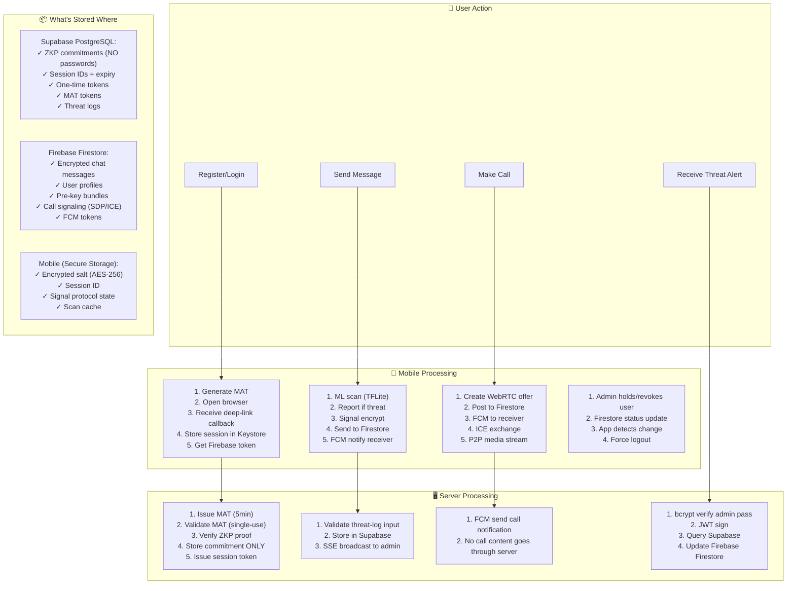
```mermaid
flowchart TD
    subgraph USER_ACTION["👤 User Action"]
        UA1["Register/Login"]
        UA2["Send Message"]
        UA3["Make Call"]
        UA4["Receive Threat Alert"]
    end

    subgraph MOBILE_PROCESSING["📱 Mobile Processing"]
        MP1["1. Generate MAT\n2. Open browser\n3. Receive deep-link callback\n4. Store session in Keystore\n5. Get Firebase token"]
        MP2["1. ML scan (TFLite)\n2. Report if threat\n3. Signal encrypt\n4. Send to Firestore\n5. FCM notify receiver"]
        MP3["1. Create WebRTC offer\n2. Post to Firestore\n3. FCM to receiver\n4. ICE exchange\n5. P2P media stream"]
        MP4["1. Admin holds/revokes user\n2. Firestore status update\n3. App detects change\n4. Force logout"]
    end

    subgraph SERVER_PROCESSING["🖥️ Server Processing"]
        SP1["1. Issue MAT (5min)\n2. Validate MAT (single-use)\n3. Verify ZKP proof\n4. Store commitment ONLY\n5. Issue session token"]
        SP2["1. Validate threat-log input\n2. Store in Supabase\n3. SSE broadcast to admin"]
        SP3["1. FCM send call notification\n2. No call content goes through server"]
        SP4["1. bcrypt verify admin pass\n2. JWT sign\n3. Query Supabase\n4. Update Firebase Firestore"]
    end

    UA1 --> MP1 --> SP1
    UA2 --> MP2 --> SP2
    UA3 --> MP3 --> SP3
    UA4 --> SP4

    subgraph DATABASES["📦 What's Stored Where"]
        DB1["Supabase PostgreSQL:\n✓ ZKP commitments (NO passwords)\n✓ Session IDs + expiry\n✓ One-time tokens\n✓ MAT tokens\n✓ Threat logs"]
        DB2["Firebase Firestore:\n✓ Encrypted chat messages\n✓ User profiles\n✓ Pre-key bundles\n✓ Call signaling (SDP/ICE)\n✓ FCM tokens"]
        DB3["Mobile (Secure Storage):\n✓ Encrypted salt (AES-256)\n✓ Session ID\n✓ Signal protocol state\n✓ Scan cache"]
    end
```

---

*Document generated: April 2026 · SentriZK v1.0.4 · FYP BCSS 2024/2025*
