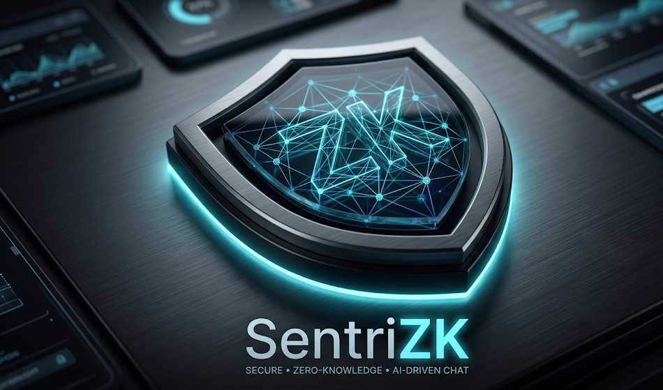

<div align="center">



# SentriZK

**Zero-Knowledge Authenticated Internal Chat with On-Device AI Threat Detection**

[](LICENSE)
[](https://nodejs.org/)
[](https://flutter.dev/)
[](https://nextjs.org/)
[](https://supabase.com/)
[](https://firebase.google.com/)
[](#zero-knowledge-authentication)
[](#ai-anomaly-detection)

---

🎓 **Final Year Project** · Bachelor of IT in Computer Systems Security (BCSS)  
📅 Academic Year 2024/2025 · Mohammad Azri Bin Aziz

[Features](#-features) · [Architecture](#-system-architecture) · [Quick Start](#-quick-start) · [Security](#-security-deep-dive) · [Tech Stack](#-tech-stack) · [Documentation](#-documentation)

</div>

---

## 📖 Overview

SentriZK is a secure internal messaging platform built for **Small and Medium Enterprises (SMEs)** that replaces traditional password-based login with **Zero-Knowledge Proof (ZKP) authentication** and adds **on-device AI anomaly detection** that works without breaking end-to-end encryption.

### The Problem

| Threat | Real-World Incident | Impact |
|--------|-------------------|--------|
| Credential theft from server | 2023 Slack session token breach | Attackers accessed internal comms despite MFA |
| Undetectable malicious messages | 2025 Discord malware campaign | Compromised invite links delivered multi-stage payloads |

### The Solution

| Approach | How SentriZK Differs |
|----------|---------------------|
| **Authentication** | The server **never** stores or sees passwords. It stores only a cryptographic commitment — a one-way mathematical fingerprint. Users prove identity via zk-SNARK proofs. |
| **Threat Detection** | Messages are analyzed **on-device** using TensorFlow Lite. E2E encryption is never broken; the AI model runs locally before encryption. |
| **Data Layer** | Supabase PostgreSQL for auth state, Firebase Firestore for real-time chat, Signal Protocol for E2EE messaging. |

---

## ✨ Features

<table>
<tr>
<td width="50%" valign="top">

### 🔐 Zero-Knowledge Authentication
- **No passwords stored anywhere** — server holds only Poseidon hash commitments
- Custom **Circom zk-SNARK circuits** for registration and login
- **Groth16** proving system with O(1) verification
- **24-word BIP-39 mnemonic** for account recovery
- **AES-256 encrypted salt** on mobile device
- **One-time nonces** (60s TTL) prevent replay attacks

</td>
<td width="50%" valign="top">

### 💬 Encrypted Messaging
- **Signal Protocol** (Double Ratchet) for E2EE
- **WebRTC** peer-to-peer audio/video calling
- Real-time messaging via **Firebase Firestore**
- Per-message forward secrecy
- Pre-key bundles for asynchronous sessions

</td>
</tr>
<tr>
<td width="50%" valign="top">

### 🤖 On-Device AI Threat Detection
- **TensorFlow Lite** model running locally on mobile
- Phishing link detection and insider threat scoring
- Privacy-preserving — analysis happens **before encryption**
- Threat logs forwarded to admin dashboard
- Configurable sensitivity threshold

</td>
<td width="50%" valign="top">

### 🔗 Cross-Platform Auth Bridge
- Novel **Mobile Access Token (MAT)** protocol
- Mobile → Browser → Mobile deep-link flow
- `sentriapp://` custom URI scheme
- 5-minute single-use tokens
- Device-bound session binding

</td>
</tr>
</table>

### Additional Capabilities

- 🌙 **Dark/Light Mode** — follows system OS preference
- 🔔 **Push Notifications** — via Firebase Cloud Messaging
- 👤 **Profile Setup** — display name, avatar, status
- 🛡️ **Admin Dashboard** — user management, threat log viewer, real-time SSE updates
- 📊 **Rate Limiting** — 10 req/min on auth endpoints, 5 req/min on admin login

---

## 🏗 System Architecture

```
┌──────────────────────────────────────────────────────────────────────────┐
│                           CLIENT LAYER                                   │
├────────────────────────────────┬─────────────────────────────────────────┤
│   📱 Mobile App (Flutter)      │   🌐 Web Portal (Next.js 15)            │
│                                │                                         │
│   • Auth Screen + Deep Links   │   • Registration Page (ZKP gen)         │
│   • E2EE Chat (Signal Proto)   │   • Login Page (ZKP gen)                │
│   • TFLite Threat Detection    │   • Admin Dashboard                     │
│   • WebRTC Calling             │   • Recovery Flow                       │
│   • Secure Storage (KeyStore)  │   • MAT Validation                      │
└───────────────┬────────────────┴──────────────┬──────────────────────────┘
                │          HTTPS                │
┌───────────────▼───────────────────────────────▼──────────────────────────┐
│                    BACKEND SERVER (Node.js + Express)                     │
│                                                                          │
│   Auth Routes          Session Routes          Admin Routes              │
│   POST /register       POST /validate-session  POST /admin/login         │
│   POST /login          POST /refresh-session   GET  /admin/users         │
│   GET  /commitment     POST /logout            POST /admin/users/hold    │
│   POST /firebase-token POST /threat-log        POST /admin/users/revoke  │
│                                                                          │
│   Security: Rate Limiting · CORS · MAT Validation · JWT Admin Auth       │
│   ZKP:      snarkjs Groth16 Verifier · Poseidon Hash · Nonce Mgmt       │
└──────────┬────────────────────────────┬──────────────────────────────────┘
           │                            │
    ┌──────▼──────┐              ┌──────▼──────┐
    │  Supabase   │              │  Firebase   │
    │  PostgreSQL │              │  Firestore  │
    │             │              │             │
    │  • users    │              │  • profiles │
    │  • sessions │              │  • chats    │
    │  • tokens   │              │  • messages │
    │  • MATs     │              │  • signals  │
    │  • threats  │              │  • FCM      │
    └─────────────┘              └─────────────┘
```

### Authentication Flow (Simplified)

```
📱 Mobile                    🌐 Browser                  🖥️ Backend              🗄️ Supabase
   │                            │                           │                       │
   │─── Request MAT ───────────►│                           │                       │
   │◄── MAT token ─────────────│                            │                       │
   │                            │                           │                       │
   │─── Open browser ──────────►│                           │                       │
   │                            │── ZKP Proof ─────────────►│── Verify proof ──────►│
   │                            │                           │◄─ Store commitment ───│
   │                            │◄── Session token ─────────│                       │
   │                            │                           │                       │
   │◄── Deep link callback ────│                            │                       │
   │                            │                           │                       │
   │─── Firebase token req ────────────────────────────────►│                       │
   │◄── Custom token ──────────────────────────────────────│                       │
   │                            │                           │                       │
   │─── signInWithCustomToken ─────────────────────────────────────────────────────►│
   ✅ Authenticated                                                                  │
```

---

## 🚀 Quick Start

### Prerequisites

| Tool | Version | Purpose |
|------|---------|---------|
| **Node.js** | 18+ | Backend server |
| **Flutter** | 3.8+ | Mobile app |
| **Dart** | 3.8+ | Flutter language |
| **Git** | 2.x | Version control |

### 1. Clone & Install

```bash
git clone https://github.com/mohammadazri/SentriZK-InternalChat.git
cd SentriZK-InternalChat
```

### 2. Backend Setup

```bash
cd Backend
npm install

# Copy and configure environment variables
cp .env.example .env
# Edit .env with your Supabase and admin credentials
```

<details>
<summary>📋 <b>Backend .env variables</b></summary>

| Variable | Description |
|----------|-------------|
| `ADMIN_USERNAME` | Admin dashboard login username |
| `ADMIN_PASSWORD` | Admin dashboard login password |
| `JWT_SECRET` | Secret key for signing admin JWT tokens |
| `JWT_TTL` | Admin token expiry (e.g., `1h`) |
| `SUPABASE_URL` | Your Supabase project URL |
| `SUPABASE_SERVICE_ROLE_KEY` | Supabase service role key (from Project Settings → API) |

You also need a `serviceAccountKey.json` from your Firebase project (Project Settings → Service Accounts → Generate New Private Key).

</details>

```bash
node server.js
# 🚀 Server starts on http://localhost:6000
```

### 3. Web Frontend Setup

```bash
cd Frontend/web
npm install

cp .env.example .env.local
# Edit .env.local with your API URL and circuit paths
```

```bash
npm run dev
# 🌐 Web app starts on http://localhost:3000
```

### 4. Mobile App Setup

```bash
cd Frontend/mobile
flutter pub get

# Configure Backend/Web URLs in:
# lib/config/app_config.dart
```

```bash
flutter run
# 📱 Launches on connected device/emulator
```

### 5. Database Schema

Run the following SQL in your [Supabase SQL Editor](https://supabase.com/dashboard):

<details>
<summary>📋 <b>Click to expand SQL schema</b></summary>

```sql
CREATE TABLE users (
    username text PRIMARY KEY,
    commitment text NOT NULL,
    "registeredAt" bigint NOT NULL,
    "lastLogin" bigint,
    status text DEFAULT 'active',
    "heldAt" bigint,
    "heldBy" text,
    nonce text,
    "nonceTime" bigint
);

CREATE TABLE sessions (
    "sessionId" text PRIMARY KEY,
    username text NOT NULL,
    expires bigint NOT NULL,
    "createdAt" bigint NOT NULL,
    "deviceId" text,
    "validatedAt" bigint,
    "refreshedAt" bigint
);

CREATE TABLE tokens (
    token text PRIMARY KEY,
    username text NOT NULL,
    expires bigint NOT NULL,
    type text NOT NULL,
    "sessionId" text
);

CREATE TABLE mobile_access_tokens (
    mat text PRIMARY KEY,
    "deviceId" text NOT NULL,
    action text NOT NULL,
    expires bigint NOT NULL,
    used boolean DEFAULT false,
    "createdAt" bigint NOT NULL
);

CREATE TABLE threat_logs (
    id text PRIMARY KEY,
    "senderId" text NOT NULL,
    "receiverId" text NOT NULL,
    content text NOT NULL,
    "threatScore" float8 NOT NULL,
    timestamp bigint NOT NULL,
    "reportedAt" bigint NOT NULL,
    "resolutionStatus" text,
    "resolvedBy" text,
    "resolvedAt" bigint
);
```

</details>

---

## 📂 Project Structure

```
SentriZK-InternalChat/
│
├── Backend/                          # Node.js + Express API server
│   ├── server.js                     # All routes, middleware, Supabase client
│   ├── serviceAccountKey.json        # Firebase Admin SDK credentials
│   ├── .env.example                  # Environment variable template
│   └── circuits/                     # Circom ZKP circuits
│       ├── registration.circom       # Registration proof circuit
│       ├── login.circom              # Login proof circuit
│       ├── circomlib/                # Poseidon, Num2Bits, etc.
│       ├── key_generation/           # Verification keys (.json)
│       ├── registration/             # Compiled WASM + R1CS
│       └── login/                    # Compiled WASM + R1CS
│
├── Frontend/
│   ├── web/                          # Next.js 15 web application
│   │   ├── src/
│   │   │   ├── app/                  # App Router pages
│   │   │   │   ├── register/         # ZKP registration flow
│   │   │   │   ├── login/            # ZKP login flow
│   │   │   │   ├── signin/           # Username entry page
│   │   │   │   └── forgot-password/  # Account recovery
│   │   │   ├── auth/                 # registerLogic.ts, loginLogic.ts
│   │   │   ├── lib/                  # secureCrypto, saltEncryption, zkp
│   │   │   └── components/           # WalletConnector, ThemeToggle
│   │   ├── public/circuits/          # Client-side WASM + zkey files
│   │   └── .env.example              # Frontend env template
│   │
│   └── mobile/                       # Flutter mobile application
│       ├── lib/
│       │   ├── config/app_config.dart # All URLs, timeouts, ML config
│       │   ├── screens/              # auth_screen, chat, profile, calling
│       │   ├── services/             # auth_service, user_service, notification
│       │   ├── models/               # Data models
│       │   ├── providers/            # State management
│       │   └── widgets/              # Reusable UI components
│       ├── assets/ml/                # TFLite model + vocabulary
│       └── .env.example              # Mobile env template
│
├── ML/                               # Machine learning training pipeline
│   ├── sentrizk_master_trainer.py    # Model training script
│   ├── DataSet/                      # Training datasets
│   ├── models/                       # Exported TFLite models
│   └── test/                         # Model evaluation scripts
│
├── Doc/                              # Full documentation suite
│   ├── architecture/                 # System diagrams, auth flow
│   ├── security/                     # Phishing detection docs
│   ├── ml/                           # Model training documentation
│   ├── guides/                       # Quick start, deployment
│   └── Images/                       # Logos, architecture diagrams
│
└── error_fix/                        # Troubleshooting guides
```

---

## 🔒 Security Deep Dive

### Zero-Knowledge Authentication

The core innovation: the server **never sees the user's password or secret**. It only stores a Poseidon hash commitment. Authentication works by proving knowledge of the secret without revealing it.

#### Registration Circuit

```circom
// Backend/circuits/registration.circom
template Registration() {
    signal input secret;      // Private: derived from wallet + password
    signal input salt;        // Private: derived from 24-word mnemonic
    signal input unameHash;   // Public:  keccak256(username)

    // Range checks
    component secretBits = Num2Bits(256);  // 256-bit secret
    component saltBits = Num2Bits(128);    // 128-bit salt

    // commitment = Poseidon(secret, salt, unameHash)
    component H = Poseidon(3);
    signal output commitment;
    commitment <== H.out;  // Server stores ONLY this value
}
```

#### Login Circuit

```circom
// Backend/circuits/login.circom
template Login() {
    signal input secret;             // Private
    signal input salt;               // Private
    signal input unameHash;          // Public
    signal input storedCommitment;   // Public: from server DB
    signal input nonce;              // Public: server-issued, 60s TTL

    // Recompute and verify commitment matches
    H1.out === storedCommitment;     // Constraint: must match

    // Bind proof to nonce (prevents replay)
    // session = Poseidon(storedCommitment, nonce)
    signal output pubCommitment;
    signal output pubSession;
}
```

#### Security Properties

| Property | Guarantee |
|----------|-----------|
| **Zero-Knowledge** | Server learns nothing except `valid` or `invalid` |
| **Soundness** | Forging a valid proof requires breaking BN128 (2^128 ops) |
| **Non-Interactive** | Single message from prover to verifier |
| **Replay-Proof** | Each proof is bound to a unique 60-second nonce |
| **Forward Secrecy** | Compromising one session reveals nothing about past sessions |

### Cryptographic Stack

| Protocol | Usage | Security Level |
|----------|-------|---------------|
| **Groth16 (zk-SNARK)** | Proof generation & verification | 128-bit |
| **Poseidon Hash** | ZK-friendly commitment scheme | 128-bit |
| **BN128 Curve** | Elliptic curve pairings | 128-bit |
| **BIP-39** | 24-word mnemonic generation | 256-bit entropy |
| **AES-256-GCM** | Salt encryption on device | 256-bit |
| **Signal Protocol** | E2EE message encryption | Double Ratchet |

### Defense Matrix

| Attack | Traditional Defense | SentriZK Defense |
|--------|-------------------|-----------------|
| **Database breach** | Hashed passwords (crackable) | No passwords stored — only Poseidon commitments (irreversible) |
| **Replay attack** | CSRF tokens | Cryptographic nonces embedded in ZK proofs (60s TTL) |
| **Session hijacking** | Long-lived JWTs | 30-min sessions + device binding + rotation on refresh |
| **Brute force** | CAPTCHA | Rate limiting + 3s proof generation cost per attempt |
| **Man-in-the-middle** | TLS only | ZK proofs are meaningless without the private secret |
| **Malicious messages** | Server-side scanning (breaks E2EE) | On-device TFLite inference before encryption |

---

## 🛠 Tech Stack

### Backend

| Technology | Version | Role |
|-----------|---------|------|
| Node.js + Express | 18+ / 5.x | API server |
| snarkjs | 0.7.5 | ZKP proof verification |
| circomlibjs | 0.1.7 | Poseidon hash, field arithmetic |
| Supabase (PostgreSQL) | — | Users, sessions, tokens, threat logs |
| Firebase Admin SDK | — | Custom token generation, Firestore admin |
| bcryptjs | — | Admin password hashing |
| jsonwebtoken | — | Admin JWT authentication |
| express-rate-limit | 8.x | DDoS / brute force protection |

### Web Frontend

| Technology | Version | Role |
|-----------|---------|------|
| Next.js (App Router) | 15 | React framework with SSR |
| React | 19 | UI library |
| TypeScript | 5.x | Type safety |
| snarkjs | 0.7.5 | Browser-side ZKP proof generation |
| bip39 | 3.x | Mnemonic generation |
| crypto-js | 4.x | AES salt encryption |
| js-sha3 | 0.9 | Keccak-256 username hashing |

### Mobile

| Technology | Version | Role |
|-----------|---------|------|
| Flutter | 3.8 | Cross-platform UI framework |
| Dart | 3.8 | Language |
| flutter_secure_storage | 9.x | KeyStore / Keychain / DPAPI encrypted storage |
| firebase_core + cloud_firestore | — | Real-time messaging backend |
| tflite_flutter | — | On-device ML inference |
| app_links | 6.x | Deep link handling |
| encrypt | 5.x | AES encryption utilities |

### Circuits

| Technology | Role |
|-----------|------|
| Circom 2.x | Circuit authoring language |
| Groth16 | Proving system (trusted setup) |
| Powers of Tau (2^12) | Trusted setup ceremony |
| circomlib | Poseidon, Num2Bits, comparators |

---

## 🤖 AI Anomaly Detection

The ML threat detection module runs entirely on-device to preserve end-to-end encryption privacy.

| Aspect | Detail |
|--------|--------|
| **Model** | TensorFlow Lite (< 1 MB) |
| **Training** | Python pipeline (`ML/sentrizk_master_trainer.py`) |
| **Features** | Tokenized message content, sequence length 120 |
| **Threshold** | Configurable (default: `0.65` threat score) |
| **Min Words** | Messages < 4 words are skipped to avoid false positives |
| **Inference** | < 100ms per message on modern phones |
| **Privacy** | Analysis happens **before** encryption — raw text never leaves the device |

Flagged messages generate a threat log sent to the admin dashboard via `POST /threat-log` with validated input constraints (max 2000 chars, score 0.0–1.0).

---

## 📊 Performance

| Metric | Value |
|--------|-------|
| ZKP proof generation (browser) | ~2–3 seconds |
| ZKP proof verification (server) | < 50 ms |
| Proof size | 192 bytes (compressed) |
| Registration circuit constraints | 1,247 |
| Login circuit constraints | 1,486 |
| Session TTL | 30 minutes |
| Nonce TTL | 60 seconds |
| MAT TTL | 5 minutes |
| ML inference time | < 100 ms |

---

## 📚 Documentation

| Document | Path |
|----------|------|
| System Architecture | [`Doc/architecture/`](./Doc/architecture/) |
| Authentication Flow | [`Doc/architecture/authentication_flow.md`](./Doc/architecture/authentication_flow.md) |
| Security Model | [`Doc/architecture/security_model.md`](./Doc/architecture/security_model.md) |
| Mobile App Guide | [`Doc/Frontend/`](./Doc/Frontend/) |
| ML Training Guide | [`Doc/ml/`](./Doc/ml/) |
| Phishing Detection | [`Doc/security/`](./Doc/security/) |
| Quick Start Guide | [`QUICK_SETUP_GUIDE.md`](./QUICK_SETUP_GUIDE.md) |
| Troubleshooting | [`error_fix/`](./error_fix/) |

---

## 🗺 Roadmap

### ✅ Phase 1 — ZKP Authentication (Complete)
- [x] Circom circuit design (registration + login)
- [x] Groth16 trusted setup and key generation
- [x] Backend API with snarkjs verification
- [x] Web frontend with in-browser proof generation
- [x] Flutter mobile app with deep link auth flow
- [x] MAT protocol for mobile-to-web bridge
- [x] Session management with rotation and expiry

### ✅ Phase 2 — AI Anomaly Detection (Complete)
- [x] TensorFlow Lite model training pipeline
- [x] On-device inference integration in Flutter
- [x] Threat scoring and admin reporting
- [x] E2EE chat with Signal Protocol
- [x] WebRTC audio/video calling

### 🚧 Phase 3 — Hardening & Deployment (Current)
- [x] Migration from JSON file DB to Supabase PostgreSQL
- [x] Security audit and vulnerability patching
- [x] Admin dashboard with real-time SSE updates
- [ ] User acceptance testing with SME participants
- [ ] Production deployment and monitoring
- [ ] Academic deliverables (FYP report, presentation)

---

## 🔬 Research Foundation

### Academic References

1. **Bhattacharya et al. (2024)**. *Enhancing Digital Privacy: The Application of Zero-Knowledge Proofs in Authentication Systems.* International Journal of Computer Trends and Technology, 72(4), 34–41.

2. **Natha et al. (2022)**. *A Systematic Review of Anomaly Detection Using Machine and Deep Learning Techniques.* Quaid-e-Awam University Research Journal, 20(1), 83–94.

3. **Groth, J. (2016)**. *On the Size of Pairing-Based Non-interactive Arguments.* EUROCRYPT 2016, Lecture Notes in Computer Science, vol. 9646.

### Standards Compliance

| Standard | Application |
|----------|-------------|
| NIST SP 800-63B | Digital identity and authentication guidelines |
| OWASP Top 10 | Web application security best practices |
| BIP-39 | Mnemonic code standard for key generation |
| RFC 5869 | HMAC-based Key Derivation Function (HKDF) |

---

## 👨‍🎓 Author

<div align="center">

**Mohammad Azri Bin Aziz**

🎓 Bachelor of Information Technology in Computer Systems Security (BCSS)  
📧 mohamedazri@protonmail.com  

[](https://github.com/mohammadazri)
[](mailto:mohamedazri@protonmail.com)

**Course**: IPB49804 Final Year Project · 2024/2025

</div>

---

## 📄 License

This project is licensed under the MIT License. See [LICENSE](LICENSE) for details.

---

## 🙏 Acknowledgments

- **[iden3](https://github.com/iden3)** — Circom, snarkjs, circomlibjs
- **[Google](https://flutter.dev/)** — Flutter framework
- **[Vercel](https://nextjs.org/)** — Next.js framework
- **[Supabase](https://supabase.com/)** — Open-source PostgreSQL backend
- **[Firebase](https://firebase.google.com/)** — Firestore, Auth, and FCM
- **Dr. Jens Groth** — Groth16 proving system

---

<div align="center">

**🔐 Zero-Knowledge · 🛡️ Privacy-First · 🤖 AI-Powered**

*"The server never sees your password. It doesn't need to."*

⭐ Star this repository if you find it useful!

</div>
