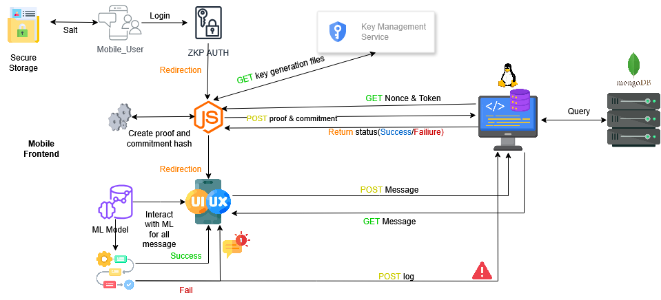

  <h1>SentriZK</h1>
  
<b>Secure Internal Messaging with Zero-Knowledge Authentication & AI Anomaly Detection</b>

    

    
    
    
    
    
  

  

---

  <h2>🌟 Project Highlights</h2>
  <table>
    <tr>
      <td align="center" width="180">
         
        <b>Zero-Knowledge Proof</b> Authenticate users without transmitting passwords
      </td>
      <td align="center" width="180">
         
        <b>On-Device AI</b> Detect suspicious behaviors locally
      </td>
      <td align="center" width="180">
         
        <b>End-to-End Encryption</b> Secure all messages in transit
      </td>
      <td align="center" width="180">
         
        <b>Flutter + Node.js Backend</b> Real-time internal chat
      </td>
    </tr>
  </table>

---

  <h2>📂 Project Structure</h2>
  
<i>A clean overview of the main folders and files in SentriZK</i>

  
  <table>
    <tr>
      <td align="left">📁 <b>backend/</b></td>
      <td align="left">Node.js server & Zero-Knowledge Proof modules</td>
    </tr>
    <tr>
      <td align="left">📱 <b>mobile-app/</b></td>
      <td align="left">Flutter app integrated with AI anomaly detection model</td>
    </tr>
    <tr>
      <td align="left">📄 <b>docs/</b></td>
      <td align="left">Proposal, architecture diagrams, literature review</td>
    </tr>
    <tr>
      <td align="left">🧪 <b>tests/</b></td>
      <td align="left">Unit and integration tests for backend and mobile app</td>
    </tr>
    <tr>
      <td align="left">⚙️ <b>scripts/</b></td>
      <td align="left">Data preprocessing & AI model training scripts</td>
    </tr>
    <tr>
      <td align="left">📘 <b>README.md</b></td>
      <td align="left">Project documentation and overview</td>
    </tr>
    <tr>
      <td align="left">📜 <b>LICENSE</b></td>
      <td align="left">Project license details (UNIKL MIIT License)</td>
    </tr>
    <tr>
      <td align="left">❌ <b>.gitignore</b></td>
      <td align="left">Files/folders excluded from version control</td>
    </tr>
  </table>

---

  <h2>⚡ Demo Workflow</h2>
  
<i>Visual demonstration of authentication & messaging flow</i>

  
  

    1️⃣ User Registration via ZKP 
    2️⃣ End-to-End Encrypted Messaging 
    3️⃣ On-Device AI Anomaly Detection
  

---

## 🏗️ Architecture Diagram

  <!-- SVG for crisp inline preview -->
   

---

  <h2>📈 GitHub Stats</h2>
  

---

## 📬 Contact Me

If you have any questions, feedback, or inquiries regarding **SentriZK**, feel free to reach out:

---

  <h2>📄 License</h2>
  This project is licensed under the <b>MIT License</b>. See <a href="LICENSE">LICENSE</a> for details.

