# 🏛️ SentriZK Technical Architecture & System Diagrams
**Academic Defense Master Reference**

> *This document contains the highly technical, professional-grade diagrams detailing cryptographic flows, database architectures, and zero-knowledge proof implementations for the SentriZK infrastructure.*

---

## 1. Phishing Detection Architecture (WhatsApp Security Parity)
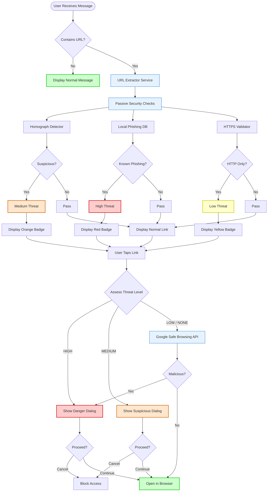

---

## 2. Full System Architecture Overview

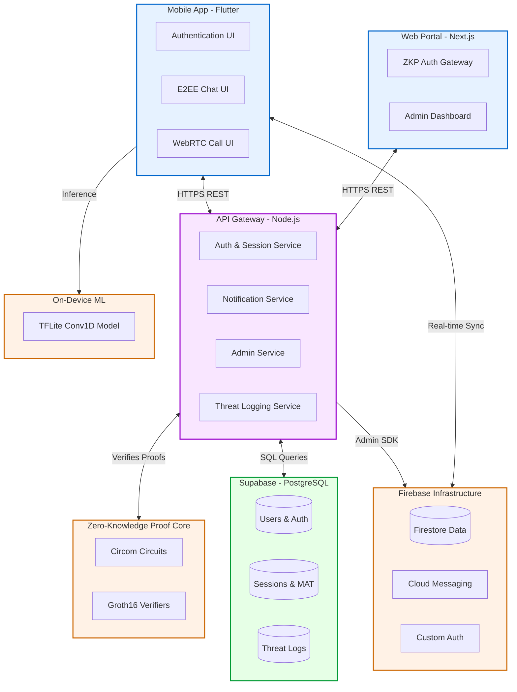

---

## 3. ZKP Registration Flow — Complete Technical Detail

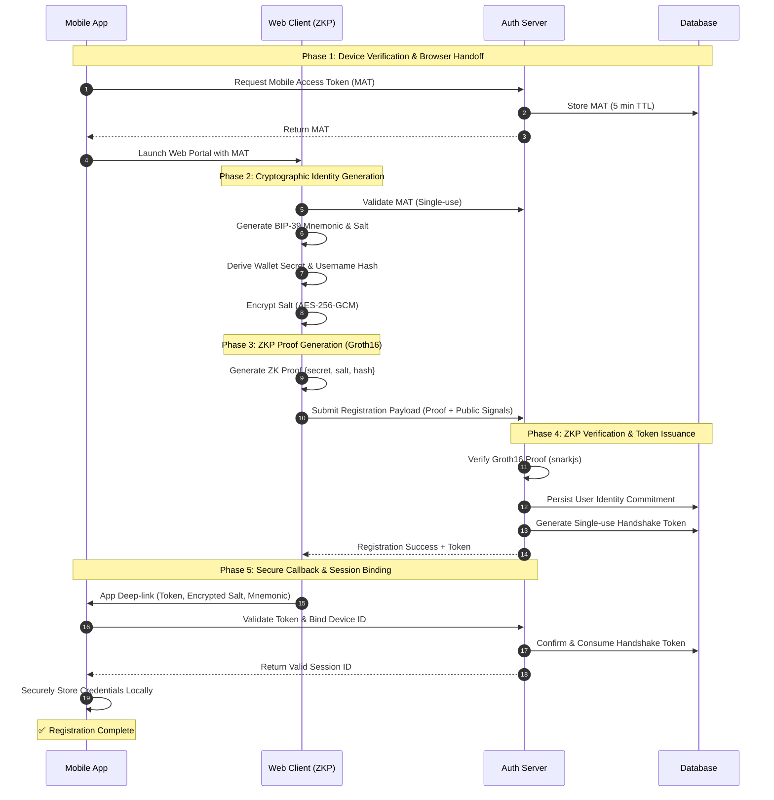

---

## 4. ZKP Login Flow — Complete Technical Detail

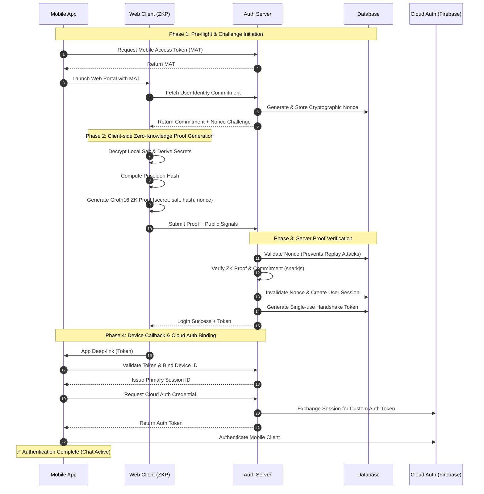

---

## 5. Signal Protocol E2EE Messaging — Complete Technical Detail

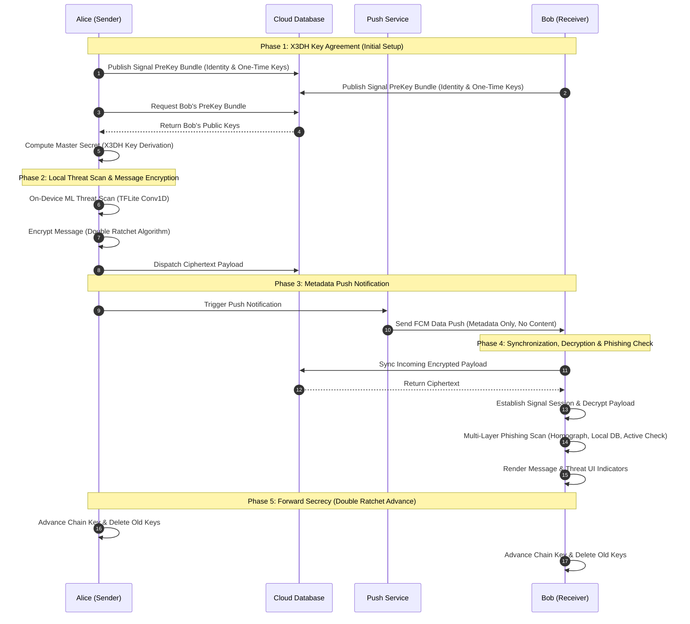

---

## 6. WebRTC Audio/Video Call Flow — Complete Technical Detail

```mermaid
sequenceDiagram
    autonumber
    participant CALLER as Caller (Alice)
    participant FS as Signaling Server (Firestore)
    participant BAK as Push Notification (FCM)
    participant BOB as Receiver (Bob)

    %% 1. Call Initiation
    Note over CALLER,BOB: Phase 1: Call Initiation & Signaling
    CALLER->>CALLER: Access Local Media (Mic/Camera)
    CALLER->>CALLER: Create WebRTC PeerConnection & Offer
    CALLER->>FS: Publish Call Offer (SDP)
    
    %% 2. Notification
    CALLER->>BAK: Trigger Incoming Call Push
    BAK->>BOB: High-Priority FCM Wakeup (Ringing)
    
    %% 3. Acceptance
    Note over BOB: Phase 2: Call Acceptance
    BOB->>FS: Subscribe to Call Updates
    BOB->>BOB: Access Local Media (Mic/Camera)
    BOB->>BOB: Create PeerConnection & Generate Answer
    BOB->>FS: Publish Call Answer (SDP)
    
    %% 4. ICE Candidates
    Note over CALLER,BOB: Phase 3: ICE Candidate Exchange (P2P Routing)
    CALLER->>FS: Publish Caller ICE Candidates
    BOB->>FS: Publish Receiver ICE Candidates
    FS-->>BOB: Sync Caller Candidates
    FS-->>CALLER: Sync Receiver Candidates & Answer
    
    %% 5. Connection
    Note over CALLER,BOB: Phase 4: Direct P2P Media Stream
    CALLER->>CALLER: Establish P2P Connection
    BOB->>BOB: Establish P2P Connection
    CALLER<-->BOB: Encrypted Audio/Video Stream (SRTP)
    
    %% 6. Termination
    CALLER->>FS: Update Call Status to Ended
    FS-->>BOB: Sync Termination Event
    CALLER->>CALLER: Close PeerConnection
    BOB->>BOB: Close PeerConnection
```

---

## 7. Firebase Architecture — Complete Data Model

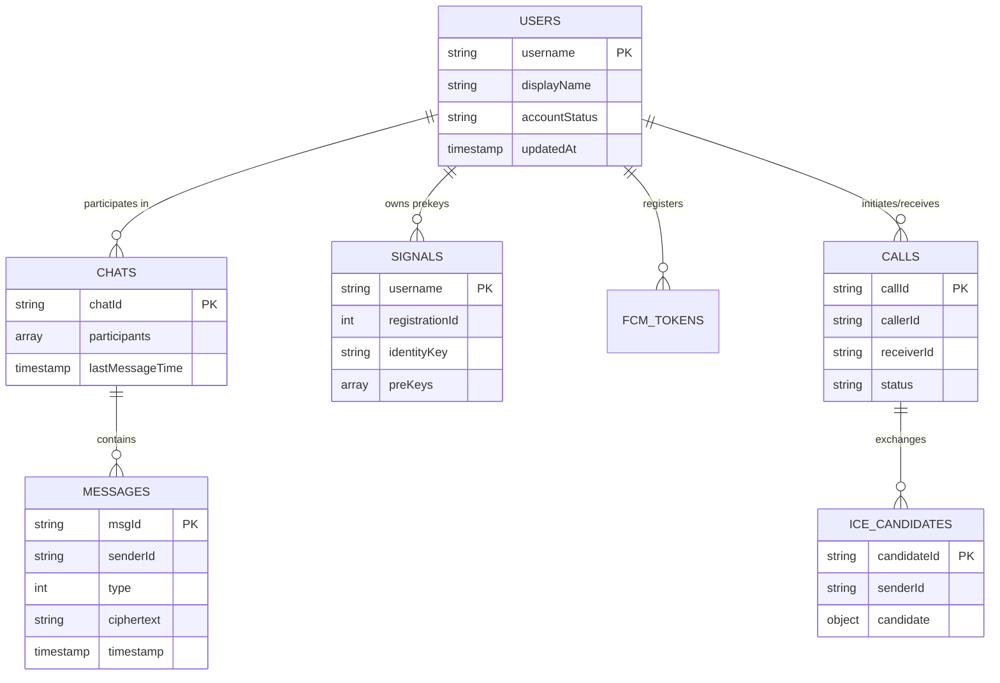

---

## 8. TFLite ML Threat Detection Pipeline

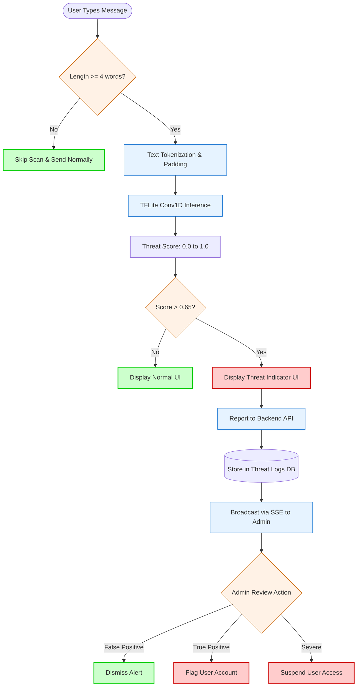

---

## 9. Admin Panel — Complete Feature Map

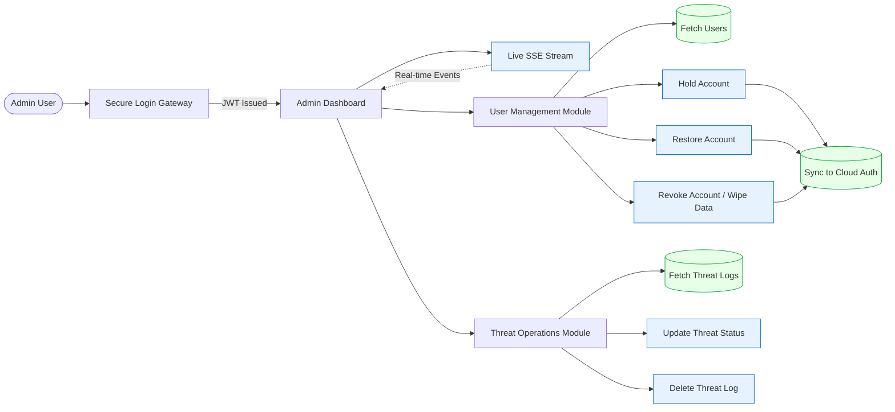

---

## 10. Session Lifecycle & Security

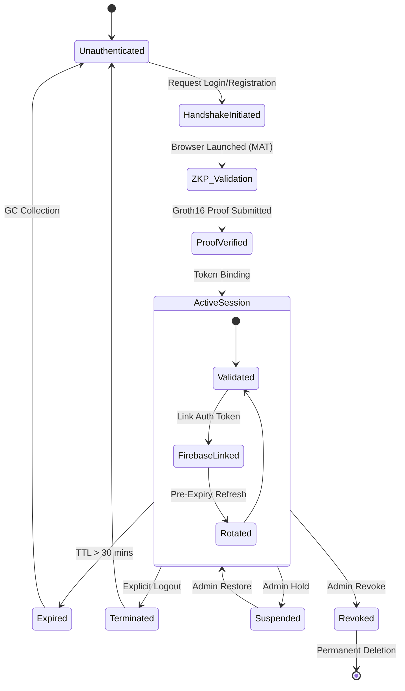

---

## 11. Detailed Cryptographic Stack Flow

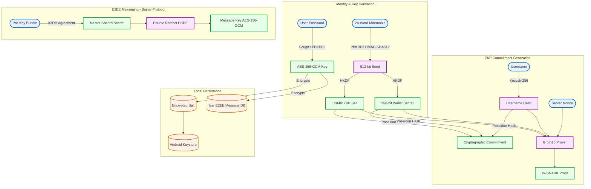

---
---

## 12. Activity Diagram: Secure User Onboarding & Key Generation

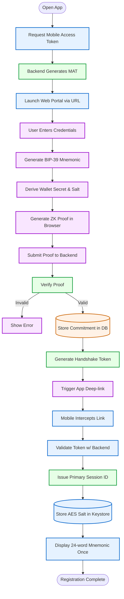

---

## 13. Activity Diagram: Real-Time Chat & Offline Synchronization

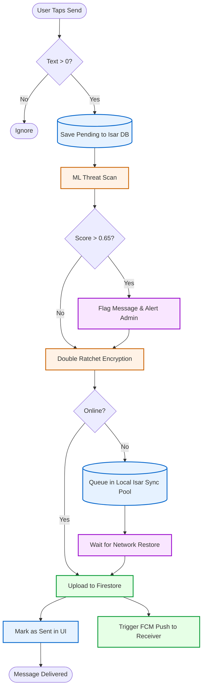

---

## 14. Component Diagram: Flutter Mobile Application

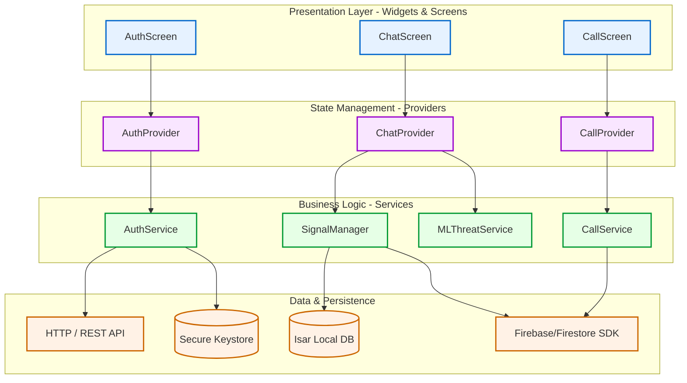

---

## 15. Deployment & Infrastructure Architecture

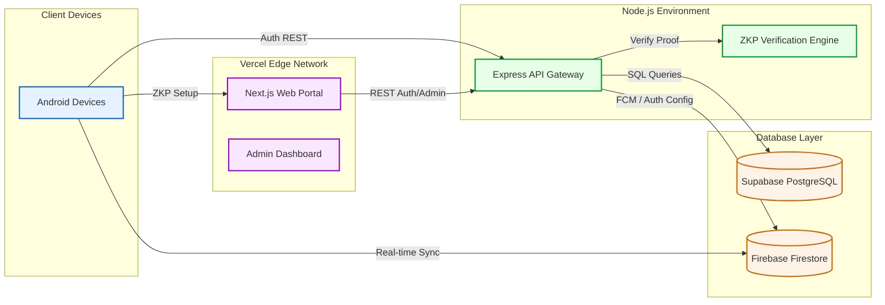

---
